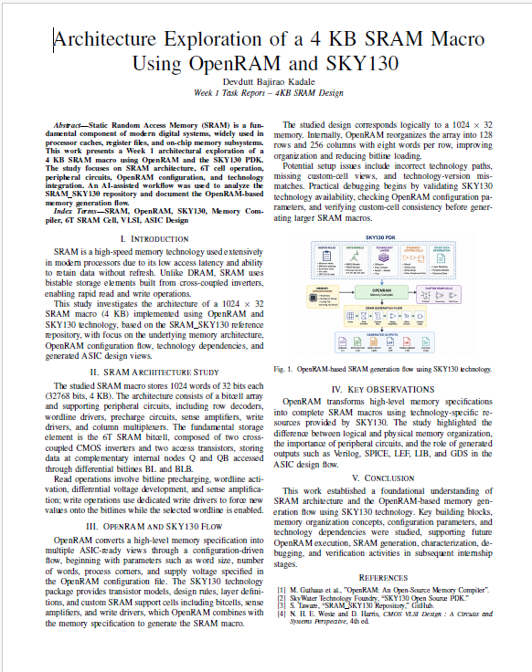

# AI-Assisted 4KB SRAM Design using OpenRAM and SKY130

## Internship Information

**Program:** AI-Assisted Analog, Mixed-Signal and FPGA Internship (Cohort 1.2)

**Organization:** VLSI System Design (VSD)

**Project:** 4KB SRAM Design using OpenRAM and SKY130

**Intern:** Devdutt Bajirao Kadale

---

## Project Overview

This repository documents my learning journey during the AI-Assisted Analog, Mixed-Signal and FPGA Internship.

The objective is to understand how a 4KB SRAM macro can be generated using OpenRAM and the SKY130 Process Design Kit (PDK), while documenting the complete learning process through an AI-assisted engineering workflow.

The focus of Week 1 is understanding SRAM fundamentals, OpenRAM architecture, SKY130 integration, and SRAM compiler outputs rather than generating a complete SRAM macro.

---

## Week 1 Deliverable

### IEEE Technical Report

**Title:**
Architecture Exploration of a 4KB SRAM Macro Using OpenRAM and SKY130 in an AI-Assisted Design Workflow

**Deliverables Completed**

* SRAM Architecture Study
* 6T SRAM Cell Analysis
* Read and Write Operations
* Precharge Circuit
* Sense Amplifier
* Row Decoder
* Column Multiplexer
* OpenRAM Configuration Study
* OpenRAM Flow Analysis
* SKY130 PDK Integration
* OpenRAM Output Analysis
* AI-Assisted Engineering Workflow Documentation

**Report Location**

```text
report/Devdutt_Kadale_SRAM_4KB_Week_1_Report.pdf
```


## Reference Design

Reference Repository:

SRAM_SKY130

Target SRAM:

```text
1024 Words × 32 Bits
=
32768 Bits
=
4096 Bytes
=
4 KB
```

Operating Voltage:

```text
1.8 V
```

Target Access Time:

```text
< 2.5 ns
```

Technology:

```text
SKY130A
```

---

## OpenRAM Flow

```text
Memory Specification
        ↓
OpenRAM Configuration
        ↓
SKY130 Technology Files
        ↓
Custom Cells
        ↓
OpenRAM Compiler
        ↓
Characterization
        ↓
Generated Outputs
```


---

## Week 1 Report Preview




## Repository Structure

```text
architecture/
├── sram_architecture.md
├── bitcell_6t.md
├── read_operation.md
├── write_operation.md
├── precharge_circuit.md
├── sense_amplifier.md
├── row_decoder.md
└── column_mux.md

docs/
├── openram_flow.md
├── sky130_pdk.md
├── design_tradeoffs.md
├── validation_strategy.md
└── decision_log.md

ai_workflow/
├── prompts.md
├── workflow.md
├── verified_answers.md
└── mistakes_found.md

journal/
└── week1.md

assets/
└── images/
```

---

## Week 1 Progress

### Completed Topics

* SRAM Memory Hierarchy
* SRAM Macro Architecture
* 6T SRAM Cell
* Read Operation
* Write Operation
* Precharge Circuit
* Sense Amplifier
* Row Decoder
* Column Multiplexer
* OpenRAM Configuration Files
* OpenRAM Generation Flow
* SKY130 Technology Integration
* OpenRAM Output Files
* Logical vs Physical Memory Organization

---

## Key Learnings

### SRAM Architecture

* SRAM uses 6T bitcells for data storage.
* Differential bitlines improve read reliability.
* Peripheral circuits enable read and write operations.

### OpenRAM

* Configuration-driven memory generation.
* Automatic creation of memory arrays and peripheral circuitry.
* Generation of ASIC-ready output views.

### SKY130

* Provides transistor models and design rules.
* Enables technology-aware SRAM generation.

---

## AI-Assisted Workflow

AI tools such as ChatGPT and Codex were used to:

* Break complex SRAM concepts into smaller learning tasks.
* Analyze repository structure.
* Investigate OpenRAM configuration and flow.
* Generate study guides and documentation drafts.

All findings were verified against repository files and technical references before inclusion.

---

## Current focus:

* Week 1 documentation completed
* IEEE report submitted
* OpenRAM installation and execution
* OpenRAM output analysis
* Week 2 experimentation

## Future Work

* OpenRAM installation and execution
* SRAM macro generation
* Timing characterization
* Verification studies
* Memory optimization
* Final project report

---

## Week 1 Repository Metrics

Documentation Created:

* 8 Architecture Documents
* 5 Technical Documents
* AI Prompt Log
* Engineering Journal
* IEEE Technical Report

Topics Covered:

* SRAM Fundamentals
* OpenRAM Flow
* SKY130 Integration
* Memory Organization
* ASIC Output Views

## Acknowledgements

* VLSI System Design (VSD)
* OpenRAM Project
* SKY130 Open PDK
* SRAM_SKY130 Reference Repository
