# AI-Assisted 4KB SRAM Design — SKY130 PDK

> **VSD Internship | Cohort 1.2 | Devdutt Bajirao Kadale**  
> AI-Assisted Analog, Mixed-Signal and FPGA Internship

[](reports/week1/)
[](reports/week2%20%26%20week3/)
[](openram/)
[](Layout/)
[](verification/waveforms/)
[](https://skywater-pdk.readthedocs.io/)
[](LICENSE)

---

## Project Overview

This repository documents the complete learning and design journey for building a **4KB SRAM macro** using:

- **SKY130 PDK** — open-source 130nm CMOS process by SkyWater + Google
- **ngspice** — transistor-level SPICE simulation
- **OpenRAM** — open-source SRAM compiler (Week 3+)
- **AI-Assisted Workflow** — every design decision logged with prompts and verification

The repository documents the circuit-level design, simulation, layout, verification, and OpenRAM-based SRAM macro generation using the SKY130A PDK. It combines transistor-level circuit development with AI-assisted documentation and compiler exploration.

---

## Current Project Status

| Stage | Status |
|--------|--------|
| SRAM Architecture Study | ✅ Complete |
| CMOS Verification | ✅ Complete |
| 6T SRAM Bitcell Schematic | ✅ Complete |
| 6T SRAM Bitcell Layout | ✅ Complete |
| 6T Bitcell DRC | ✅ Passed |
| 6T Bitcell LVS | ✅ Passed |
| OpenRAM Macro DRC | ✅ Executed |
| OpenRAM Macro LVS | ⚠️ Environment Prepared |
| Read Operation | ✅ Verified |
| Write Operation | ✅ Verified |
| SNM Analysis | ✅ Verified |
| Read Disturb | ✅ Verified |
| Write Margin | ✅ Verified |
| Precharge Circuit | ✅ Simulated |
| Write Driver | ✅ Simulated |
| Sense Amplifier | ✅ Simulated |
| Integrated 1-bit SRAM | ✅ Integrated |
| Row Decoder | 🔄 Future Work |
| Bitcell Array | 🔄 Future Work |
| 4KB SRAM Macro | 🔄 Future Work |

---

## Key Achievements

- ✅ Designed and simulated a CMOS inverter using SKY130A.
- ✅ Designed a 6T SRAM bitcell in Xschem.
- ✅ Verified read, write, SNM, read disturb, and write margin using NGSpice.
- ✅ Created a Magic layout and achieved DRC-clean implementation for the 6T SRAM bitcell.
- ✅ Successfully passed Netgen LVS for the 6T SRAM bitcell.
- ✅ Generated an OpenRAM SRAM macro and verified the GDS in Magic.
- ✅ Executed Magic DRC and documented the physical verification workflow.
- ✅ Designed and verified the SRAM Precharge Circuit.
- ✅ Designed and verified the Write Driver.
- ✅ Designed and verified the Sense Amplifier.
- ✅ Integrated all peripheral blocks with the 6T SRAM bitcell.
- ✅ Performed complete 1-bit SRAM integration using NGSpice.
- ✅ Generated integrated waveform results for control signals, bitlines and storage nodes.
- ✅ Documented the complete AI-assisted design and verification workflow.

---

## SRAM Architecture

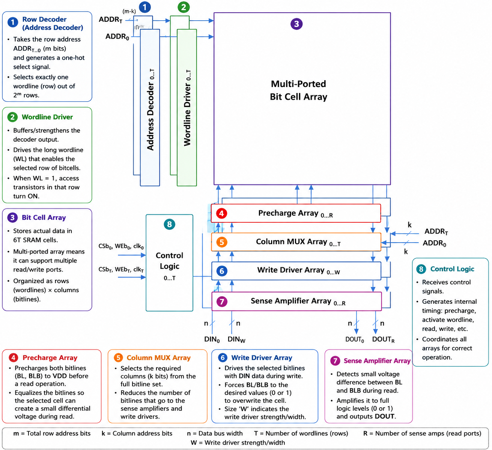

A 4KB SRAM macro consists of several key blocks working together:

| Block | Function |
|---|---|
| **6T Bitcell Array** | Stores bits using cross-coupled inverter latches |
| **Row Decoder** | Converts address bits → one-hot wordline signal |
| **Precharge Circuit** | Charges BL and BLB to VDD before every read |
| **Sense Amplifier** | Amplifies small differential voltage → full logic swing |
| **Write Driver** | Forces BL/BLB to desired data during write |
| **Column Mux** | Selects one word from multiple words per physical row |

---

## 6T SRAM Cell

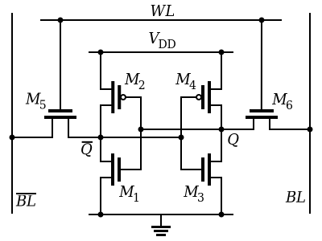

The fundamental storage unit is a **6-transistor (6T) SRAM cell**:

- **M1, M2** — PMOS pull-up transistors (form cross-coupled inverters)
- **M3, M4** — NMOS pull-down transistors (form cross-coupled inverters)
- **M5, M6** — NMOS access transistors (connect cell to BL and BLB)
- **WL** — Word line: gates of M5 and M6
- **Q, QB** — Storage nodes (complementary)

The two cross-coupled inverters hold one bit indefinitely as long as power is supplied — no refresh needed, unlike DRAM.

---

## Read and Write Operations

### Read Operation


1. **Precharge** — BL and BLB both charged to VDD = 1.8V
2. **Access** — WL asserted, M5 and M6 turn ON
3. **Discharge** — One bitline discharges slightly (ΔV ≈ 50–100mV)
4. **Sense** — Sense amplifier detects differential and snaps to full swing

> **Key constraint:** Cell Ratio (CR) = W_pulldown / W_access must be > 1.5 to prevent read disturb.

### Write Operation


1. **Drive** — Write driver forces BL=0, BLB=VDD (or vice versa)
2. **Access** — WL asserted, M5 and M6 turn ON
3. **Overwrite** — Write driver overpowers PMOS pull-up → Q flips

> **Key constraint:** Write Ratio (WR) = W_access / W_pullup must be > 1 to successfully overwrite cell.

---

## Peripheral Circuits

### Precharge Circuit

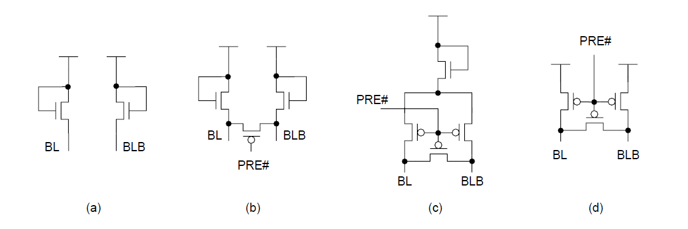

Three-PMOS topology:
- **PC1** — Pulls BL to VDD when PCB=0
- **PC2** — Pulls BLB to VDD when PCB=0
- **PC3** — Equalizer: ensures BL = BLB before sense amp fires

### Sense Amplifier

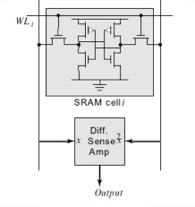

Cross-coupled CMOS latch triggered by SAE (sense amp enable):
- Input NMOS connected to BL and BLB
- Regenerative action amplifies ΔV to full logic swing in < 200ps
- SAE must fire only after sufficient ΔV has developed (≥ 50mV)

### Row Decoder

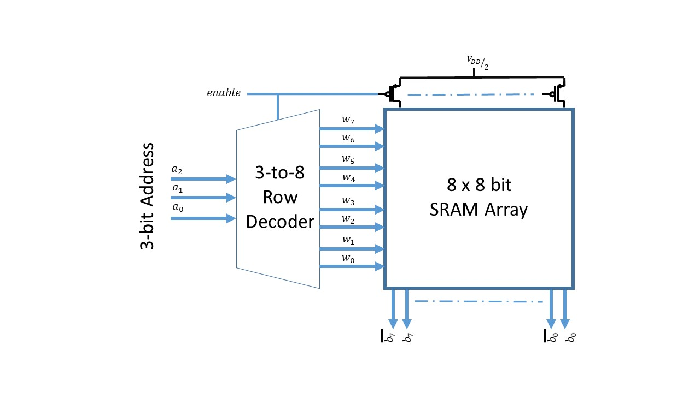

- Converts N-bit row address into 2^N one-hot wordline signals
- For 1024-row array: 10-bit address → 1024 wordlines
- Only one WL is HIGH at any time — selects exactly one row

### Column Multiplexer

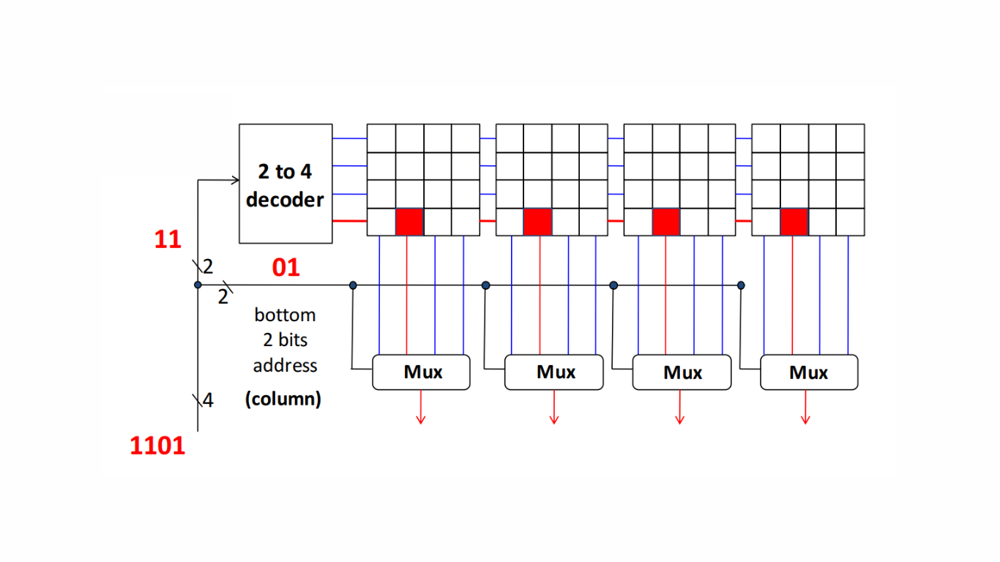

- Physical array has more columns than logical words
- Column address selects one word out of multiple words sharing the same bitlines
- Example: 128 rows × 256 columns → 8 words/row → 1024 words logical

---

## Integrated 1-Bit SRAM Verification

After verifying each peripheral block individually, a complete 1-bit SRAM was constructed by integrating:

- 6T SRAM Cell
- Precharge Circuit
- Write Driver
- Sense Amplifier

The integrated simulation verifies the interaction between all major SRAM peripheral circuits using a common NGSpice testbench.

### Integrated Simulation Flow

```text
          DIN
           │
     Write Driver
           │
      BL / BLB
           │
      6T SRAM Cell
           │
   Sense Amplifier
           │
      OUT / OUTB

Precharge Circuit
        │
      BL / BLB
```

### Bitline Waveforms

The bitline waveforms illustrate the differential behaviour of BL and BLB during the integrated memory operation after precharge and write access.

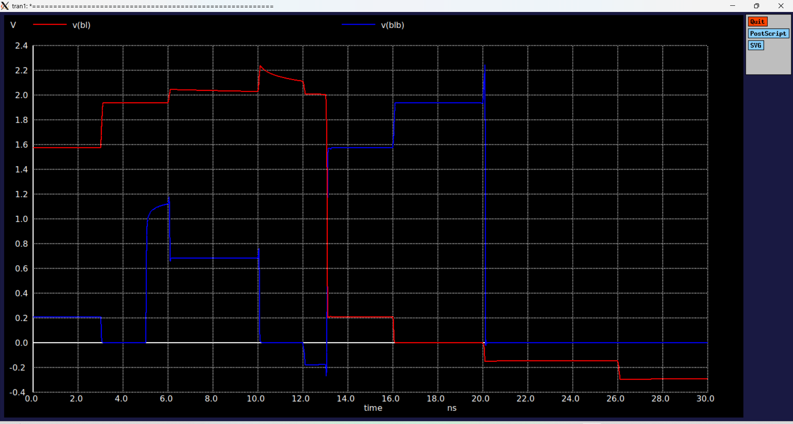

### Cell Storage Nodes

The internal storage nodes (Q and QB) demonstrate stable data retention and successful state transitions during memory access.

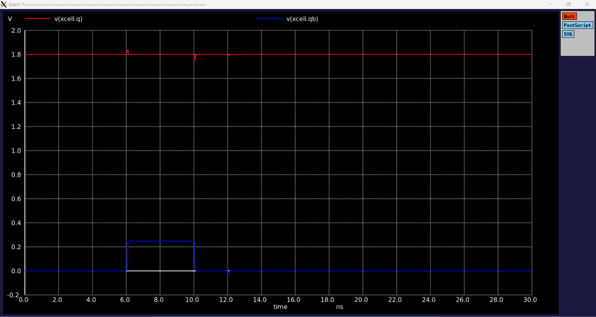

### Control Signals

The control signals verify the correct sequencing of the precharge enable (PCB), write enable (WE), wordline (WL), and sense amplifier enable (SAE).

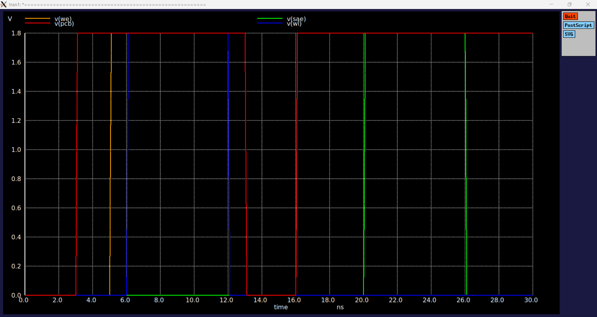

### Sense Amplifier Output

The sense amplifier regenerates the small differential voltage developed on the bitlines into full CMOS logic levels.

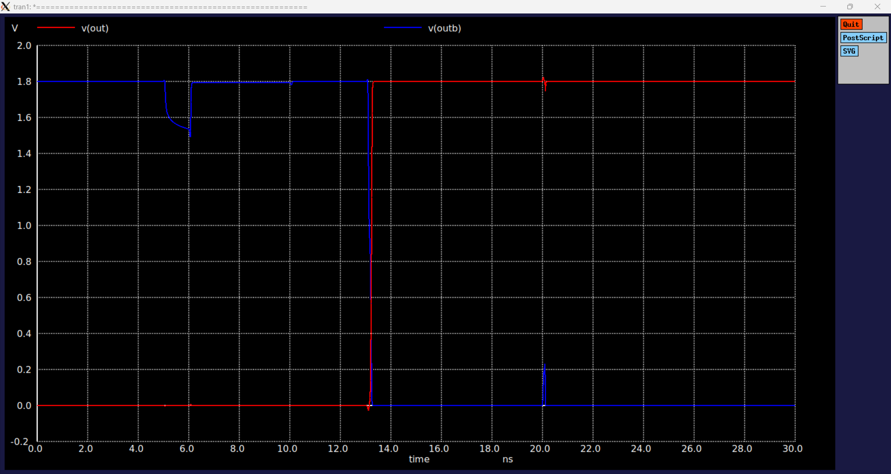


### Results

The integrated verification successfully demonstrates:

- Correct precharge operation before memory access.
- Proper wordline-controlled access to the SRAM cell.
- Successful interaction between the write driver and the 6T SRAM bitcell.
- Differential bitline activity during memory operation.
- Sense amplifier activation after bitline differential develops.
- Stable storage-node behaviour throughout the simulation.

Each peripheral circuit was verified independently before system-level integration.


### Current Limitation

The integrated 1-bit SRAM simulation successfully demonstrates functional interaction between the SRAM bitcell and the peripheral circuits.

The present implementation uses simplified peripheral circuits intended for educational verification rather than production-quality SRAM design. Additional transistor sizing optimization, write-assist techniques and timing optimization would be required for a fully optimized SRAM macro.


## OpenRAM Flow

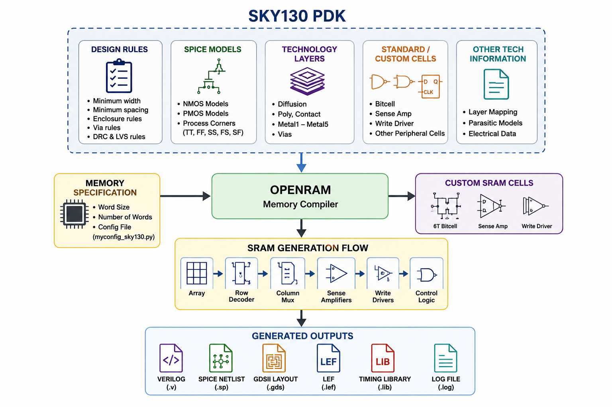

```text
Memory Specification
        │
Configuration File
        │
SKY130 Technology Files
        │
OpenRAM Compiler
        │
Characterization
        │
Generated Outputs GDS | LEF | LIB | Verilog | SPICE
```

**4KB SRAM Physical Organization:**
- Logical: 1024 words × 32 bits
- Physical: 128 rows × 256 columns, 8 words/row
- Benefit: shorter bitlines → lower capacitance → faster access

---

## Week 4 – OpenRAM SRAM Generation

The objective of Week 4 was to install OpenRAM, configure the SKY130 technology, generate an SRAM macro, and document the complete compiler workflow.

### OpenRAM Environment

- OpenRAM Version: **v1.2.49**
- Technology: **SKY130A**
- Operating System: **Ubuntu 24.04 (WSL2)**
- Python: **3.12**

### Generated Outputs

The following generated files are included in this repository:

| Output | Location |
|---------|----------|
| GDS | `results/gds/` |
| LEF | `results/lef/` |
| Liberty | `results/lib/` |
| Verilog | `results/verilog/` |
| SPICE | `results/spice/` |
| OpenRAM Log | `openram/logs/` |
| Configuration | `openram/configs/` |

### Documentation

Additional documentation is available in:

- `docs/openram/installation.md`
- `docs/openram/generated_files.md`
- `docs/openram/minimum_supported_configuration.md`
- `ai_workflow/ai_audit.md`
- `verification/reports/magic_drc_report.md`
- `verification/reports/lvs_status.md`

### OpenRAM Limitation

The internship task requested a **2-word × 16-bit SRAM**.

During implementation, the OpenRAM version used in this project enforced an internal minimum row constraint, preventing direct generation of the requested memory organization without modifying the compiler.

Following the project mentor's guidance, the repository documents the **minimum specification supported by the OpenRAM version** while preserving the standard compiler flow.

---

## Repository Structure

| Folder | Contents |
|---|---|
| `verification/spice/` | SPICE netlists for all circuit blocks |
| `verification/waveforms/` | Simulation waveform screenshots (PNG) |
| `verification/xschem/` | Schematic files (.sch) |
| `architecture/` | SRAM theory docs — 10 topics (bitcell, SA, precharge, decoder, timing...) |
| `docs/` | Design notes, validation strategy and OpenRAM documentation |
| `docs/openram/` | Installation guide, generated files and compiler limitations |
| `ai_workflow/` | AI prompt log, verified answers, mistakes caught |
| `journal/` | Week-by-week learning diary |
| `reports/week1/` | Week 1 IEEE PDF + LaTeX source |
| `reports/week2 & week3/` | Week 2&3 IEEE PDF + LaTeX with all waveforms |
| `assets/images/` | Architecture diagrams |
| `openram/` | OpenRAM configuration files (Week 4+) |
---

## Progress by Week

### ✅ Week 1 — SRAM Theory & Fundamentals

> 📄 [Download IEEE PDF](reports/week1/Devdutt_Kadale_SRAM_4KB_Week_1_Report.pdf)


**Completed:**
- Studied 6T SRAM cell, read/write operation, SNM, OpenRAM architecture
- CMOS inverter simulated with SKY130 PDK (baseline verification)
- Documented 8 architecture topics in `architecture/`
- Wrote IEEE one-page technical report

---

### ✅ Weeks 2 & 3 — Circuit Simulations (ngspice + SKY130)

> 📄 [Download IEEE PDF](reports/week2%20%26%20week3/Devdutt_Kadale_SRAM_4KB_Week2_3_Report.pdf)  
> Journal: [`journal/week2.md`](journal/week2.md)

**AI-Assisted workflow:** ChatGPT GPT-4o + Perplexity AI used for netlist generation, debugging hints and simulation setup. All prompts logged in [`ai_workflow/prompts.md`](ai_workflow/prompts.md).

#### CMOS Baseline Verification

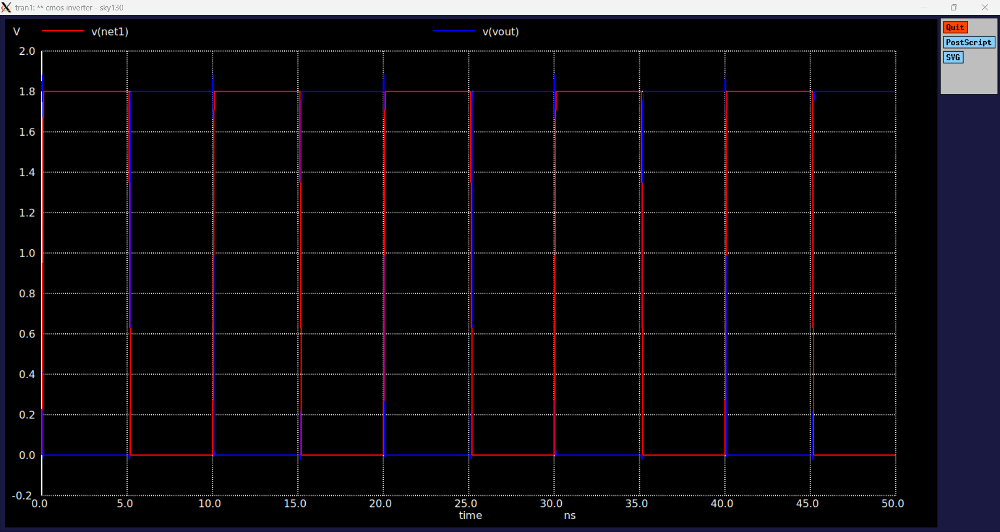

CMOS inverter simulated at VDD=1.8V TT corner to verify SKY130 PDK + ngspice integration before SRAM-specific blocks.

#### 6T SRAM Bitcell — Read Operation

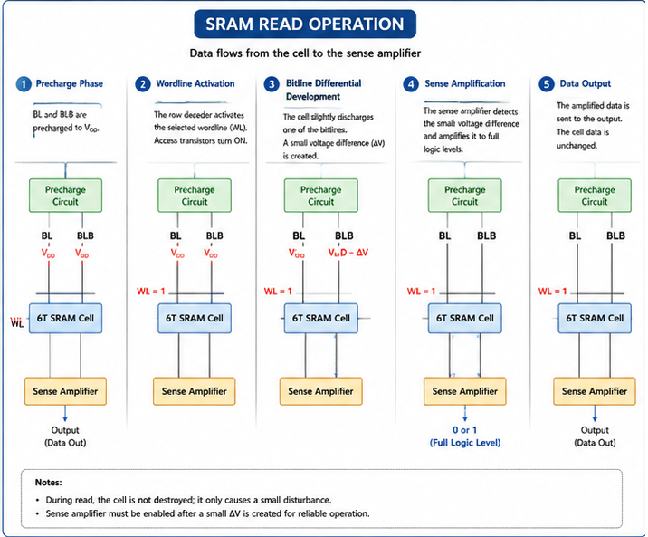

BL and BLB differential development after WL assertion. Cell ratio β > 1.5 confirmed — no read disturb.

#### 6T SRAM Bitcell — Write Operation

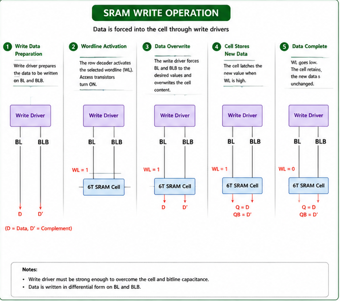

Write driver successfully overrides stored latch. Write ratio γ ≈ 1.2 confirmed.

#### Static Noise Margin — Butterfly Curve

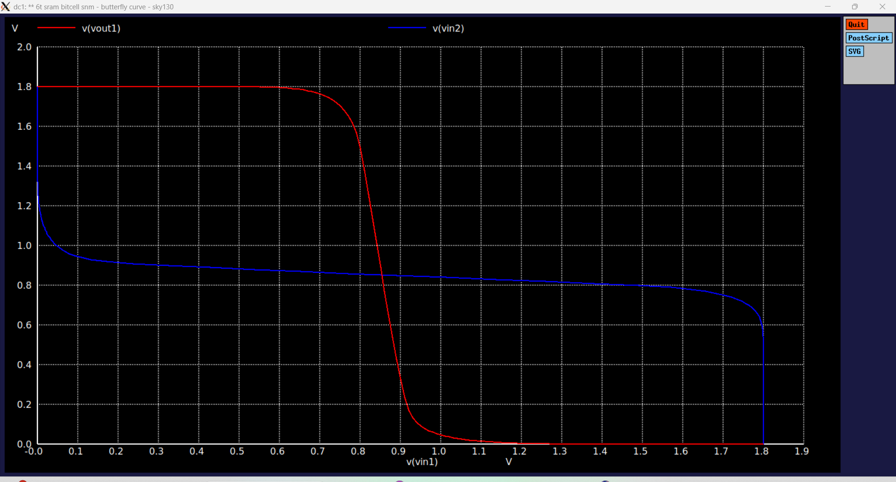

SNM ≈ 280–320 mV at TT corner, 1.8V. Consistent with published SKY130 bitcell values.

#### Read Disturb Analysis

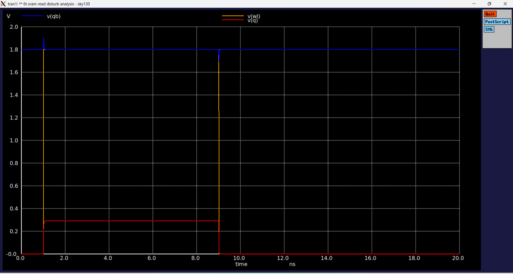

Q node voltage recovers after WL assertion — data integrity confirmed with standard SKY130 cell sizing.

#### Write Margin Analysis

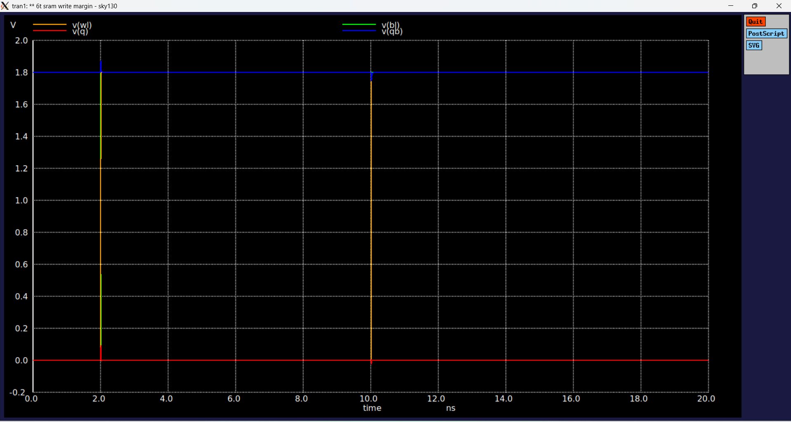

Latch flip threshold analysis confirms reliable write operation across process corners.

#### New Architecture Docs Added
- [`wordline_control.md`](architecture/wordline_control.md) — WL timing and driver sizing
- [`bitline_behaviour.md`](architecture/bitline_behaviour.md) — BL capacitance and precharge analysis
- [`sram_timing_sequence.md`](architecture/sram_timing_sequence.md) — Full read/write cycle timing

### Additional Integrated Verification

During the final stage of Weeks 2 & 3, the independently verified SRAM building blocks were integrated into a complete 1-bit SRAM testbench.

The integrated design includes:

- 6T SRAM Cell
- Precharge Circuit
- Write Driver
- Sense Amplifier

The complete integrated simulation generated bitline, storage-node, control-signal and output waveforms, demonstrating correct interaction between the major SRAM peripheral circuits.

---

### ✅ Week 4 — OpenRAM Setup & Macro Generation

Completed:
- Installed OpenRAM v1.2.49 on Ubuntu 24.04 (WSL2)
- Configured SKY130A technology environment
- Created OpenRAM SRAM configuration
- Executed OpenRAM compiler
- Investigated OpenRAM minimum row constraint
- Documented minimum supported OpenRAM configuration
- Generated and archived GDS, LEF, Liberty, Verilog and SPICE outputs
- Created AI Audit documentation
- Created regression testbench and simulation log
- Executed behavioral regression simulation using Icarus Verilog

### Documentation

Additional documentation is available in:

- docs/openram/installation.md
- docs/openram/generated_files.md
- docs/openram/minimum_supported_configuration.md
- ai_workflow/ai_audit.md

### Physical Verification

#### Magic DRC

- Successfully imported the generated SRAM GDS into Magic.
- Executed DRC using the SKY130A technology file.
- DRC execution completed successfully.
- The reported DRC rule categories have been documented in `verification/reports/magic_drc_report.md` for future investigation.

#### Netgen LVS

- Verified Netgen installation and SKY130A LVS setup.
- Verified the generated OpenRAM SPICE and LVS netlists.
- Prepared the environment for layout-versus-schematic verification.
- Current LVS status is documented in `verification/reports/lvs_status.md`.

---

### 🔲 Week 5 — Final Documentation & Repository Completion

Remaining:
- Final project report
- Repository cleanup
- Final documentation review

---

## How to Run Simulations

```bash
# Clone the repo
git clone https://github.com/devduttkadale1/AI-Assisted-4KB-SRAM-SKY130_devdutt_kadale.git
cd AI-Assisted-4KB-SRAM-SKY130_devdutt_kadale

# Run any waveform simulation (example: SRAM read)
cd verification/spice
# Read simulation
ngspice -b sram_read.spice

# Write simulation
ngspice -b sram_write.spice

# SNM analysis
ngspice -b snm_butterfly.spice
```

**Prerequisite:** SKY130 PDK installed at `/usr/local/share/pdk/sky130A/`

---

## Tools & Environment

| Tool | Version | Purpose |
|---|---|---|
| ngspice | 42 | SPICE simulation |
| SKY130 PDK | Combined lib, TT corner | 130nm transistor models |
| xschem | latest | Schematic capture |
| OpenRAM | latest | SRAM compiler (Week 4+) |
| ChatGPT GPT-4o | June 2026 | Netlist generation, debugging |
| Perplexity AI | June 2026 | Design verification, prompts |

---

## AI Workflow

Every AI interaction is logged in [`ai_workflow/prompts.md`](ai_workflow/prompts.md) with:
- Exact prompt used
- AI tool and model name
- Generated output (netlist / explanation)
- Verification method
- Mistakes caught and corrections made

See [`ai_workflow/workflow.md`](ai_workflow/workflow.md) for the full methodology.

---

## Intern Information

**Name:** Devdutt Bajirao Kadale  
**Program:** VSD AI-Assisted Analog, Mixed-Signal and FPGA Internship (Cohort 1.2)  
**Duration:** June – August 2026  
**Contact:** [GitHub](https://github.com/devduttkadale1)
---

## VSD Internship Task Status

This repository is prepared for the assigned **4kB SRAM Design** track.

| Task | Requirement | Status |
|---|---|---|
| Task 1 - Week 1 | SRAM fundamentals + reference repo study + IEEE report | Complete |
| Task 2 - Week 2 & 3 | Circuit-level SRAM blocks using AI-assisted workflow | Complete |
| Task 3 - Week 4 | Demonstration video and README link | Pending video link |

Detailed task status is available in [`TASK_STATUS.md`](TASK_STATUS.md).

---

## Final 6T Bitcell LVS Status

The 6T SRAM bitcell schematic and layout have been verified using Netgen LVS.

| Item | File |
|---|---|
| Layout LVS netlist | `Layout/sram_6t_cell_lvs_clean.spice` |
| Schematic SPICE | `verification/xschem/schematic/bitcell/sram_6t_bitcell.spice` |
| LVS report | `lvs_report.txt` |

Final LVS Result

✔ Number of devices: 6

✔ Netlists match uniquely.

✔ Final Result: Circuits Match Uniquely.


---

## Clean Repository Structure

This repository is organized around the assigned VSD internship tasks only.

| Path | Purpose |
|---|---|
| `TASK_STATUS.md` | Summary of Task 1, Task 2, and Task 3 status |
| `reports/week1/` | Week 1 IEEE report |
| `reports/week2 & week3/` | Week 2 and Week 3 circuit-level SRAM report |
| `verification/spice/` | SRAM circuit SPICE decks |
| `verification/xschem/` | Xschem schematic and bitcell SPICE |
| `verification/waveforms/` | Verified waveform screenshots |
| `Layout/` | Final 6T bitcell Magic layout and LVS-ready netlist |
| `Layout/debug_history/` | Old LVS/debug reports kept for transparency |
| `architecture/` | SRAM architecture notes |
| `docs/` | Design notes and validation strategy |
| `ai_workflow/` | AI prompts, workflow, mistakes, and verified answers |
| `assets/images/` | README/report images |
| `references/` | External reference repo links |

---

## Integrated Verification Summary

The final stage of this project focused on integrating the independently verified SRAM peripheral circuits into a complete 1-bit SRAM architecture.

The integrated design includes:

- 6T SRAM Bitcell
- Write Driver
- Precharge Circuit
- Sense Amplifier

The integrated NGSpice simulation verified:

- Control signal sequencing
- Bitline behaviour
- Internal storage node transitions
- Sense amplifier response
- Functional integration of the major SRAM building blocks

This integration serves as the functional foundation for extending the design toward a complete multi-bit and 4KB SRAM macro.

---

## Future Work

The current repository focuses on circuit-level implementation and verification of the 6T SRAM bitcell. Future work includes:

- Row Decoder
- Column Decoder
- Column Multiplexer
- Wordline Driver
- Hierarchical SRAM Array Integration
- Complete 4KB SRAM Macro
- Post-layout Extraction
- Process, Voltage and Temperature (PVT) Corner Verification
- Timing Characterization

The repository stores representative OpenRAM-generated deliverables together with the supporting documentation required for the internship while avoiding unnecessary copies of large external SKY130 PDK libraries and intermediate generated files.