# AI-Assisted 4KB SRAM Design using SKY130 PDK and OpenRAM

> **VSD AI-Assisted Analog, Mixed-Signal & FPGA Internship | Cohort 1.2**  
> **Designer:** Devdutt Bajirao Kadale

[](reports/week1/)
[](reports/week2%20%26%20week3/)
[](reports/week5/)
[](week6_task5/)
[](week6_task5/integration/sta_signoff/)
[](openram/)
[](https://skywater-pdk.readthedocs.io/)
[](verification/reports/)
[](verification/reports/)
[](LICENSE)

---

> [!NOTE]
> **Project Summary**
>
> - **Internship:** VSD AI-Assisted Analog, Mixed-Signal & FPGA Internship
> - **Technology:** SKY130A Open-Source PDK
> - **Design Flow:** **Xschem → NGSpice → Magic VLSI → Netgen LVS → OpenRAM**
> - **Validated Intermediate Macro:** **16 × 16 SRAM Macro (256-bit)**
> - **Current Target:** **1024 × 32 SRAM Macro (4 KB) — Task 5 / Week 6**
> - **Current Status:** **Task 5 complete — generation, functional regression, physical sign-off, C-extracted TT/SS/FF characterization, RTL integration, OpenSTA STA, reproducibility, and final documentation closed**
> - **Focus:** AI-assisted SRAM design, verification, physical validation, and documentation

## ♻️ Reproduce This Project

Want to clone, regenerate, and verify the final Week 6 Task 5 SRAM?

➡️ **[Step-by-step clone and reproducibility guide](week6_task5/reproducibility/README.md)**

The guide covers environment setup, OpenRAM/SKY130 paths, SRAM regeneration,
the 144-test functional regression, physical-signoff evidence,
characterization, integration, OpenSTA STA, and reproducibility limitations.

---

## Task 5 — 1024 × 32 SRAM Sign-off Checkpoint

The Week 6 Task 5 target is a **1024-word × 32-bit single-port SRAM (4 KB)** generated with **OpenRAM v1.2.49** using **SKY130**.

Current validated results:

- Production GDS, LEF, Verilog, SPICE, and TT/SS/FF Liberty views generated
- Automated functional regression: **144 PASS / 0 FAIL**
- Magic DRC: **0 errors**
- Corrected full Magic extraction completed
- Extracted top-level SPICE generated
- Final Netgen LVS device count: **270248 vs 270248**
- Final Netgen LVS net count: **69617 vs 69617**
- Final Netgen result: **Circuits match uniquely**
- LVS property error count: **0**
- Targeted C-extracted characterization completed at **TT / SS / FF**
- Logical 1024 × 32 RTL wrapper integration regression: **13 PASS / 0 FAIL**
- External **OpenSTA 3.1.0** SS-corner STA: **PASS**
- SS setup slack: **+2.138 ns**
- SS hold slack: **+0.056 ns**
- SS minimum characterized period: **2.241 ns**
- Maximum characterized SS model frequency: **446.229362 MHz**
- Characterized clock-to-DOUT validation: **0.446 / 0.478 / 0.606 ns**
- Clean-clone regeneration and functional regression completed
- Final artifact manifest: **40 validated artifacts**

The authoritative checkpoint artifacts and verification evidence are stored under [`week6_task5/`](week6_task5/).

**Task 5 is complete.** Characterization, Liberty comparison, RTL integration, external OpenSTA timing analysis, clean-clone reproducibility, AI evidence, and final sign-off documentation are available under [`week6_task5/`](week6_task5/).

> - **Last Updated: September 2026 — Week 6 Task 5 final sign-off complete**

---

## 🖼️ Week 6 Task 5 — 4 KB SRAM Final Implementation & Sign-off

The following screenshots document the final **1024 × 32 single-port 4 KB SRAM**
implementation and its major verification milestones.

### 1. Final 1024 × 32 / 4 KB SRAM Physical Layout

<p align="center">
  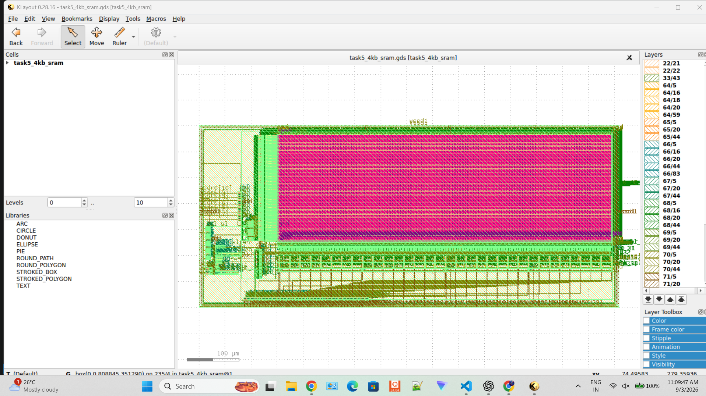
</p>

**Final OpenRAM-generated 1024 × 32 single-port SRAM macro (4 KB) viewed in KLayout.**
The committed GDS is the authoritative physical implementation used for Task 5 sign-off.

---

### 2. Automated Functional Regression

<p align="center">
  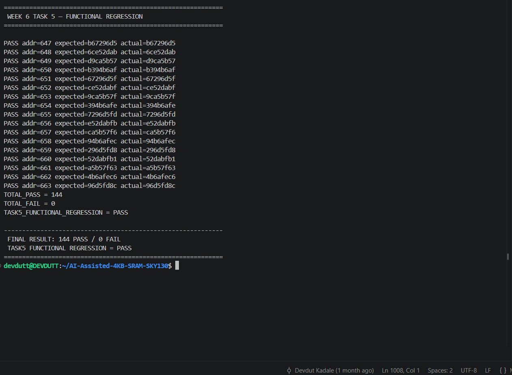
</p>

**Functional regression result: 144 PASS / 0 FAIL.**

The regression covered representative first, last, and boundary addresses using
all-zero, all-one, alternating, walking-one, walking-zero, and deterministic
pseudo-random data patterns.

---

### 3. Magic DRC Physical Sign-off

<p align="center">
  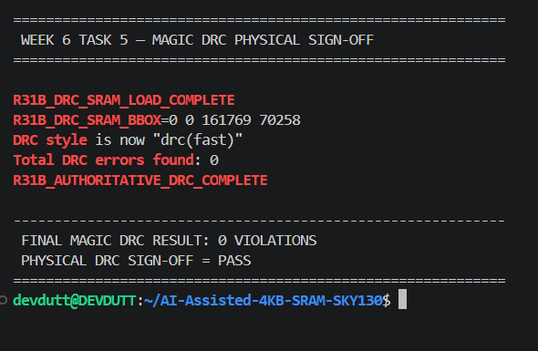
</p>

**Final authoritative Magic DRC result: 0 violations.**

This confirms that the signed-off physical layout passes the final design-rule check.

---

### 4. Netgen LVS Sign-off

<p align="center">
  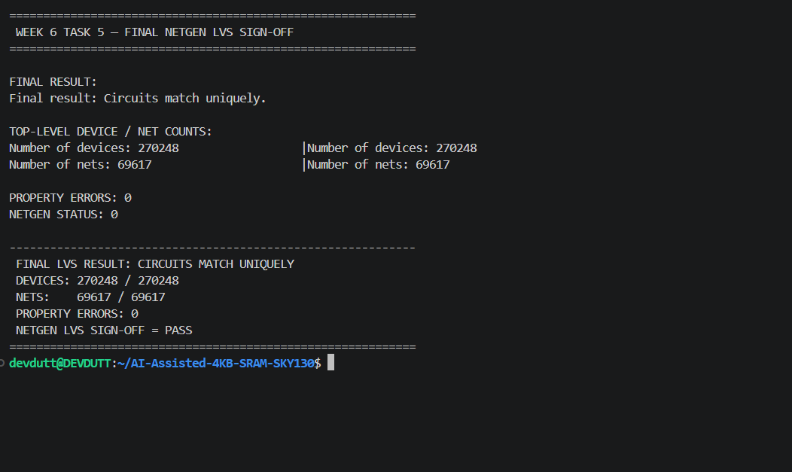
</p>

**Final Netgen LVS result: Circuits match uniquely.**

- Devices: **270248 / 270248**
- Nets: **69617 / 69617**
- Property errors: **0**

---

### 5. C-Extracted TT / SS / FF Characterization

<p align="center">
  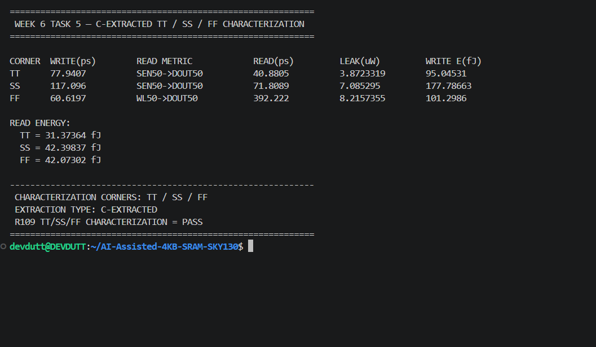
</p>

**Targeted C-extracted characterization completed at TT, SS, and FF corners.**

The characterization includes read timing, write timing, leakage power,
read energy, and write energy for the targeted physically extracted SRAM path.

> The characterization is **C-extracted**, not RC-extracted.

---

### 6. OpenSTA 3.1.0 SS-Corner Timing Sign-off

<p align="center">
  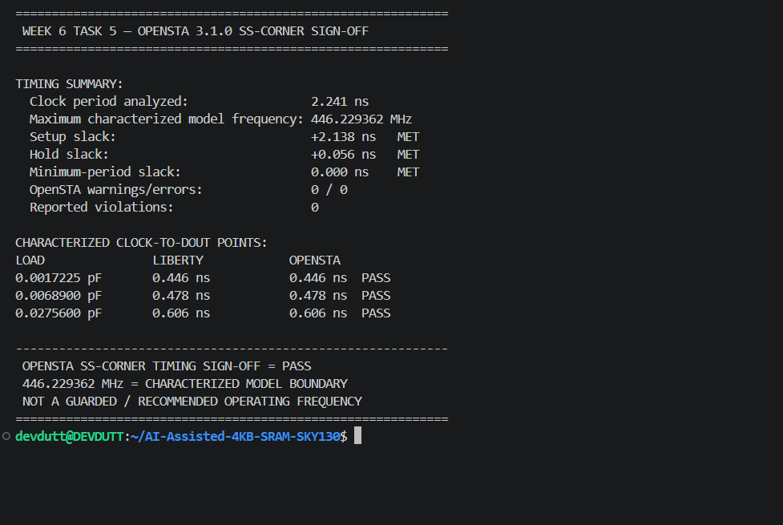
</p>

**External OpenSTA SS-corner timing analysis: PASS.**

- Setup slack: **+2.138 ns**
- Hold slack: **+0.056 ns**
- Minimum-period slack: **0.000 ns**
- Minimum characterized period: **2.241 ns**
- Maximum characterized timing-model boundary: **446.229362 MHz**
- Reported violations: **0**

> **446.229362 MHz is the characterized Liberty-model boundary, not a guard-banded operating-frequency recommendation.**

---

### 7. Logical 1024 × 32 RTL Integration

<p align="center">
  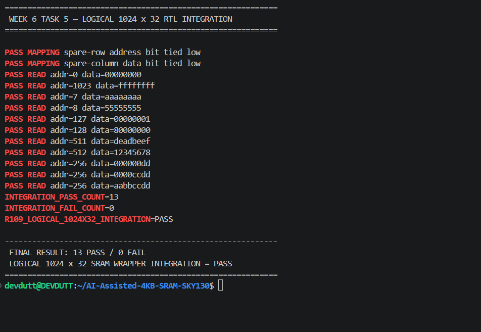
</p>

**Logical 1024 × 32 SRAM wrapper integration regression: 13 PASS / 0 FAIL.**

The integration verifies logical address/data mapping, spare-resource disabling,
boundary-address accesses, representative data patterns, and byte-write masking.

---

### Week 6 Task 5 Visual Sign-off Summary

| Verification Stage | Result |
|---|---|
| Final 4 KB physical macro | ✅ Generated and inspected |
| Functional regression | ✅ 144 PASS / 0 FAIL |
| Magic DRC | ✅ 0 violations |
| Netgen LVS | ✅ Circuits match uniquely |
| C-extracted TT/SS/FF characterization | ✅ Complete |
| OpenSTA SS timing analysis | ✅ PASS |
| RTL integration regression | ✅ 13 PASS / 0 FAIL |


## 📊 Repository at a Glance

| Category | Details |
|-----------|---------|
| 🎯 Project Goal | AI-Assisted 4KB SRAM Design using SKY130 PDK and OpenRAM |
| 🧪 Validated Intermediate Macro | 16 × 16 SRAM Macro (256-bit) |
| 🎯 Final Target | 1024 × 32 SRAM Macro (4 KB) |
| 📌 Current Phase | **Task 5 COMPLETE — full 1024 × 32 SRAM sign-off, characterization, integration, OpenSTA STA, and reproducibility closed** |
| 🛠 EDA Tools | Xschem, NGSpice, Magic VLSI, Netgen, OpenRAM |
| 📐 Technology | SKY130A Open-Source PDK |
| 🧩 Major Circuit Blocks | CMOS Inverter, 6T SRAM Cell, Precharge, Write Driver, Sense Amplifier |
| 📈 Verification | Read, Write, SNM, Read Disturb, Write Margin, Integrated SRAM |
| 📄 Generated Outputs | GDSII, LEF, SPICE, Verilog, Liberty, HTML |
| 🤖 AI Assistance | Design Planning, Debugging, Verification, Documentation |

---

## 📈 Repository Statistics

| Metric | Value |
|---------|------:|
| Internship Duration | Through 6 Weeks |
| SRAM Cells Designed | 6T CMOS SRAM Bitcell |
| Major Circuit Blocks | 8 |
| SPICE Simulations | 10+ |
| Physical Verification Reports | 5+ |
| Validated OpenRAM Outputs | Task 4: 16 × 16 intermediate; **Task 5: 1024 × 32 final 4 KB SRAM — GDS, LEF, SPICE, Verilog, TT/SS/FF Liberty** |
| Documentation | 1000+ Lines |
| Technology | SKY130A Open-Source PDK |

---

## Overview

This repository documents the complete **AI-assisted design, simulation, verification, and OpenRAM generation workflow** for an SRAM design using the **SKY130A Open-Source PDK**.

The project was completed as part of the **VSD AI-Assisted Analog, Mixed-Signal & FPGA Internship**, covering the complete development flow from transistor-level circuit design through OpenRAM-based SRAM macro generation and physical verification using open-source EDA tools.

The repository combines:

- Transistor-level SRAM circuit design using **Xschem**
- Circuit verification using **NGSpice**
- Layout design and inspection using **Magic VLSI**
- Layout-versus-Schematic verification using **Netgen**
- SRAM macro generation using **OpenRAM v1.2.49**
- AI-assisted engineering workflow with complete documentation and verification

---

## 📂 Repository Navigation

Explore different stages of the project directly.

| Section | Description |
|---------|-------------|
| 🏗 **Architecture** | SRAM architecture, memory organization, and design concepts. [architecture/](architecture/) |
| ⚙️ **Circuit Design** | CMOS inverter, 6T SRAM cell, peripheral circuits. [docs/](docs/) |
| 📈 **Verification** | NGSpice simulations, SNM analysis, waveform validation. [verification/](verification/) |
| 🧩 **OpenRAM** | OpenRAM setup, compiler flow, generated SRAM macro. [openram/](openram/) |
| 📄 **Reports** | Weekly internship reports and documentation. [reports/](reports/) |
| 🖼 **Generated Outputs** | GDSII, LEF, Liberty, Verilog, SPICE and HTML files. [generated/](generated/) |

## Project Highlights

| Feature | Status |
|---------|:------:|
| CMOS Inverter Verification | ✅ |
| 6T SRAM Bitcell Design | ✅ |
| Read / Write Operation Verification | ✅ |
| Static Noise Margin (SNM) Analysis | ✅ |
| Read Disturb & Write Margin Analysis | ✅ |
| Peripheral Circuit Design | ✅ |
| Integrated 1-Bit SRAM Verification | ✅ |
| OpenRAM SRAM Macro Generation | ✅ |
| Physical Verification | ✅ |
| Final Generated SRAM Macro | **Validated 1024 × 32 SRAM Macro (4 KB)** |

> **Repository Note**
>
> The repository contains the validated **16 × 16 SRAM macro (256-bit)**
> generated during Task 4, together with the complete investigation of the
> requested **2-word × 16-bit SRAM organization**.
>
> During Task 4, the original `words_per_row=8` organization was shown to be
> invalid because it produced zero calculated rows. A corrected
> `words_per_row=1` organization successfully passed SRAM configuration and
> progressed through array construction, but the normal OpenRAM v1.2.49 flow
> subsequently rejected the resulting 2-row bank at the hierarchical decoder.
>
> No OpenRAM source, SKY130 technology files, or custom cells were modified
> to bypass this limitation.
>
> **Task 5 completed the required 1024 × 32 SRAM organization (4 KB).**
> Generation, functional regression, DRC, extraction, clean LVS, targeted
> C-extracted TT/SS/FF characterization, RTL integration, OpenSTA STA,
> reproducibility, AI evidence, and final sign-off documentation are complete.

---


## Current Project Status

The repository documents the complete development flow of the internship project, from SRAM architecture exploration and transistor-level circuit verification to OpenRAM-based SRAM macro generation and supporting documentation.

| Development Stage | Status |
|-------------------|:------:|
| SRAM Architecture Study | ✅ Complete |
| CMOS Inverter Verification | ✅ Complete |
| 6T SRAM Bitcell Design | ✅ Complete |
| 6T SRAM Bitcell Layout | ✅ Complete |
| 6T Bitcell DRC | ✅ Passed |
| 6T Bitcell LVS | ✅ Passed |
| Read Operation Verification | ✅ Verified |
| Write Operation Verification | ✅ Verified |
| Static Noise Margin (SNM) Analysis | ✅ Verified |
| Read Disturb Analysis | ✅ Verified |
| Write Margin Analysis | ✅ Verified |
| Precharge Circuit Design | ✅ Verified |
| Write Driver Design | ✅ Verified |
| Sense Amplifier Design | ✅ Verified |
| Integrated 1-Bit SRAM Verification | ✅ Complete |
| OpenRAM Environment Setup | ✅ Complete |
| Task 4 — OpenRAM Investigation | ✅ Complete |
| Task 4 — 16 × 16 Intermediate Macro | ✅ Generated / Validated |
| Task 4 — 2 × 16 Normal-Flow Limitation | ✅ Documented |
| Task 5 — 1024 × 32 Architecture | ✅ Established |
| Task 5 — Configuration | ✅ Complete |
| Task 5 — 1024 × 32 Compilation | ✅ Complete |
| Task 5 — Core Physical Sign-off | ✅ DRC + Extraction + Clean LVS |
| Task 5 — TT/SS/FF Characterization | ✅ Complete |
| Task 5 — RTL Integration | ✅ 13 PASS / 0 FAIL |
| Task 5 — External OpenSTA STA | ✅ PASS |
| Task 5 — Clean-Clone Reproducibility | ✅ Complete |
| Task 5 — Final Documentation / AI Evidence | ✅ Complete |
| Current Validated Macro | **1024 × 32 SRAM Macro (4 KB)** |
| Final Project Target | **1024 × 32 SRAM Macro (4 KB)** |

> **Current Scope**
>
> The repository currently contains the completed circuit-level design and
> verification work, the validated 16 × 16 OpenRAM intermediate macro from
> Task 4, and the documented investigation of the requested 2 × 16
> organization.
>
> **Task 5 delivers the required 1024 × 32 single-port 4 KB SRAM macro.**
> Production generation, physical sign-off, C-extracted characterization,
> Liberty comparison, RTL integration, OpenSTA static timing analysis,
> reproducibility, and final documentation are complete.

---

## 🧠 Skills Demonstrated

`CMOS Design` • `SRAM Design` • `SPICE Simulation` • `Magic VLSI`
`Netgen LVS` • `OpenRAM` • `SKY130A` • `Git`
`Technical Documentation` • `AI-assisted Engineering`

## Key Achievements

The project successfully integrates circuit-level SRAM design, transistor-level verification, physical implementation, OpenRAM-based SRAM generation, and AI-assisted engineering practices using the SKY130A Open-Source PDK. The key technical achievements are summarized below.

## Circuit Design & Verification

The following SRAM building blocks were designed, simulated, and verified using **Xschem**, **NGSpice**, and the **SKY130A Open-Source PDK**.

- ✅ Designed and simulated a CMOS inverter using the SKY130A PDK.
- ✅ Designed a 6T SRAM bitcell in Xschem.
- ✅ Verified SRAM read and write operations using NGSpice.
- ✅ Performed Static Noise Margin (SNM) analysis using butterfly curves.
- ✅ Verified read disturb and write margin characteristics.
- ✅ Designed and verified the SRAM precharge circuit.
- ✅ Designed and verified the write driver.
- ✅ Designed and verified the sense amplifier.
- ✅ Integrated all major peripheral circuits into a functional 1-bit SRAM testbench.

## Physical Design & Verification

The custom SRAM bitcell layout and the generated OpenRAM SRAM macro were inspected and verified using **Magic VLSI** and **Netgen**, demonstrating both custom-layout verification and compiler-generated macro validation.

- ✅ Created the 6T SRAM bitcell layout in Magic VLSI.
- ✅ Achieved DRC-clean implementation for the custom SRAM bitcell.
- ✅ Successfully completed Netgen LVS verification with matching schematic and layout.
- ✅ Inspected the generated OpenRAM SRAM layout hierarchy using Magic VLSI.
- ✅ Executed and documented the physical verification workflow for the generated SRAM macro.

## OpenRAM SRAM Generation

The OpenRAM compiler was configured with the SKY130A technology to generate and validate an intermediate **16 × 16 SRAM macro** during Task 4.

- ✅ Installed and configured OpenRAM v1.2.49 with the SKY130A technology.
- ✅ Generated the **16 × 16 SRAM macro** during Task 4.
- ✅ Preserved the generated GDSII, LEF, SPICE, Verilog, Liberty, and HTML outputs.
- ✅ Investigated and documented the requested 2 × 16 SRAM limitation.
- ✅ Task 5 1024 × 32 SRAM generation, sign-off, characterization, integration, OpenSTA STA, and reproducibility are complete.
- ✅ Documented the complete OpenRAM compilation and verification workflow.

## Documentation & AI-Assisted Workflow

Comprehensive technical documentation was developed throughout the internship to record design decisions, verification methodology, AI-assisted workflows, generated outputs, and project deliverables, ensuring reproducibility and transparency.

- ✅ Maintained complete AI prompt and verification records throughout the project.
- ✅ Produced weekly technical reports documenting project progress.
- ✅ Organized architecture notes, verification reports, and OpenRAM documentation.
- ✅ Preserved reproducible project structure with supporting design files and verification results.

---

# Project Results

The project successfully demonstrates the complete AI-assisted SRAM design workflow using the **SKY130A Open-Source PDK**, beginning with transistor-level circuit development and progressing through OpenRAM-based SRAM macro generation and physical verification.

## Final Project Summary

| Category | Result |
|-----------|--------|
| Technology | SKY130A Open-Source PDK |
| SRAM Bitcell | Custom 6T SRAM Cell |
| Circuit Design | Xschem |
| Circuit Simulation | NGSpice |
| Layout Tool | Magic VLSI |
| LVS Verification | Netgen |
| SRAM Compiler | OpenRAM v1.2.49 |
| Final Generated Macro | **Validated 1024 × 32 SRAM Macro (4 KB)** |
| Generated Deliverables | GDSII, LEF, SPICE, Verilog, Liberty, HTML |
| AI-Assisted Workflow | Fully Documented |

---

## Technical Results

### 1. SRAM Read Verification


The read simulation demonstrates successful differential bitline development while preserving the stored data inside the SRAM bitcell, confirming correct read functionality.

---

### 2. Static Noise Margin (SNM)

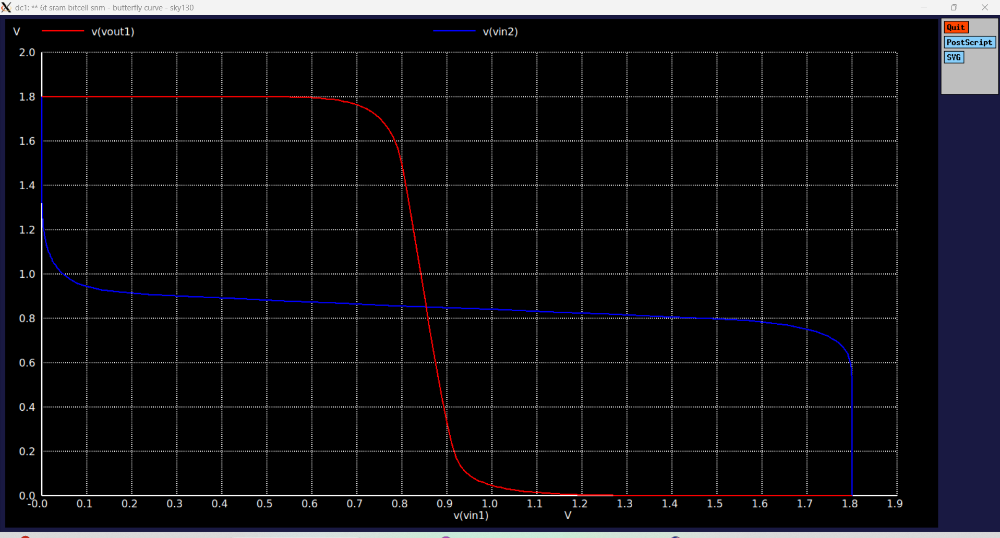

Butterfly curve analysis confirms stable operation of the custom 6T SRAM bitcell under nominal operating conditions using the SKY130A device models.

---

### 3. Integrated 1-Bit SRAM Verification

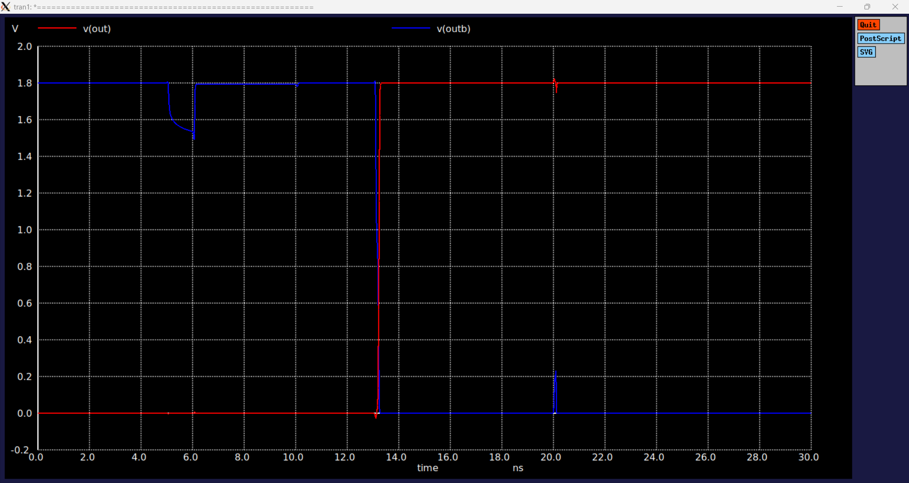

The integrated verification demonstrates correct interaction between the SRAM bitcell, write driver, precharge circuit, and sense amplifier using a common NGSpice testbench.

---

### 4. Task 4 Intermediate OpenRAM SRAM Macro

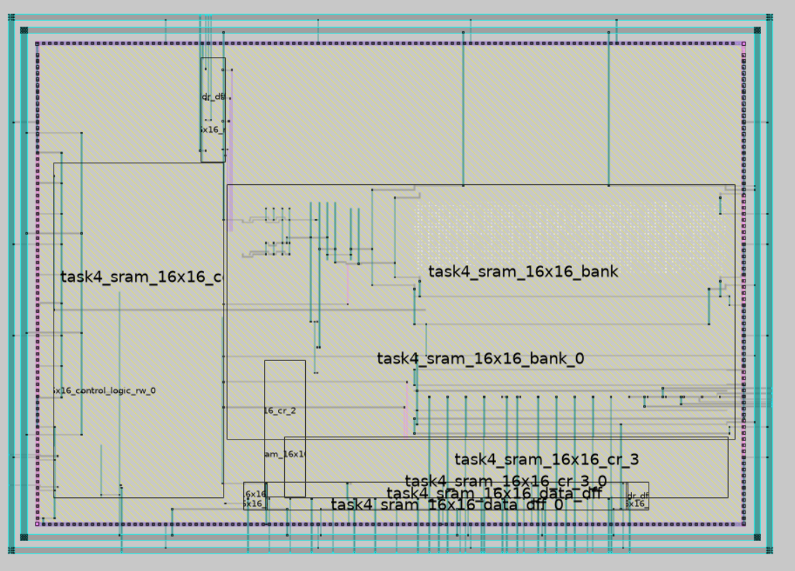

The image above shows the validated **16 × 16 Task 4 intermediate macro**. The final Task 5 deliverable is the **1024 × 32 single-port 4 KB SRAM**, with authoritative generated views and sign-off evidence under [`week6_task5/`](week6_task5/).

> **Note**
>
> The repository focuses on documenting the complete engineering workflow. Additional verification results, generated outputs, and supporting documentation are available in the `verification/`, `docs/openram/`, and `reports/week5/` directories.

---

## 🔄 Engineering Workflow

The following workflow summarizes the complete engineering process followed during the AI-assisted SRAM design and verification project.


```mermaid
flowchart LR

A[SRAM Architecture] --> B[CMOS Inverter Design]
B --> C[6T SRAM Bitcell]
C --> D[SPICE Simulation]
D --> E[SNM & Read/Write Verification]
E --> F[Peripheral Circuit Design]
F --> G[Integrated 1-Bit SRAM]
G --> H[Magic Layout]
H --> I[Netgen LVS]
I --> J[OpenRAM Configuration]
J --> K[Task 4 — 16 × 16 SRAM Generation]
K --> L[Task 4 Investigation / Validation]
L --> M[Task 5 — 1024 × 32 SRAM Configuration]
M --> N[1024 × 32 SRAM Generation]
N --> O[GDSII • LEF • SPICE • Verilog • Liberty]
```

## 📑 Table of Contents

- [Overview](#overview)
- [Project Highlights](#project-highlights)
- [Current Project Status](#current-project-status)
- [Key Achievements](#key-achievements)
- [Project Results](#project-results)
- [SRAM Architecture](#sram-architecture)
- [6T SRAM Cell](#6t-sram-cell)
- [Read & Write Operations](#read--write-operations)
- [Peripheral Circuits](#peripheral-circuits)
- [Integrated 1-Bit SRAM Verification](#integrated-1-bit-sram-verification)
- [OpenRAM Design Flow](#openram-design-flow)
- [OpenRAM SRAM Generation](#openram-sram-generation)
- [Generated Outputs](#generated-outputs)
- [Repository Structure](#repository-structure)
- [Progress Summary](#progress-summary)
- [Quick Start](#quick-start)
- [Tools & Environment](#tools--environment)
- [AI Workflow](#ai-workflow)
- [Internship Information](#internship-information)
- [Final Verification Summary](#final-verification-summary)
- [Future Work](#future-work)
- [License](#license)

---

<details>
<summary><b>🏛 SRAM Architecture & Theory (Click to Expand)</b></summary>

<br>

# SRAM Architecture

The target and final compiler-generated deliverable of this project is a **1024 × 32 single-port 4 KB Static Random Access Memory (SRAM)** using the **SKY130A Open-Source PDK**. The validated **16 × 16 SRAM macro** is retained as the Task 4 intermediate milestone.

<p align="center">
  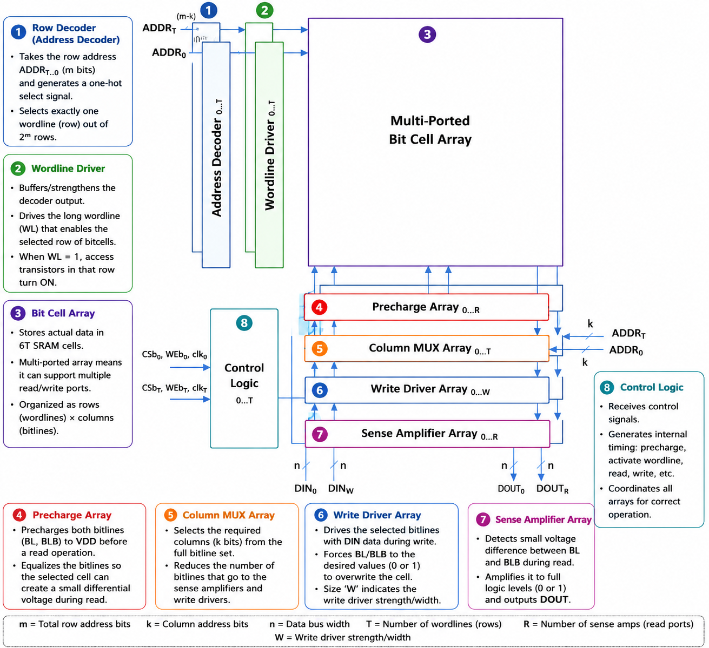
</p>

A conventional SRAM macro consists of several functional blocks that operate together during every read and write cycle.

| Block | Function |
|--------|----------|
| **6T SRAM Bitcell Array** | Stores data using cross-coupled CMOS inverters. |
| **Row Decoder** | Decodes the input address and activates the selected wordline. |
| **Wordline Driver** | Buffers and drives the selected wordline across the memory array. |
| **Precharge Circuit** | Precharges and equalizes the bitlines before every read operation. |
| **Write Driver** | Forces the required data onto the bitlines during write operations. |
| **Sense Amplifier** | Detects and amplifies small bitline voltage differences during read operations. |
| **Column Multiplexer** | Selects the required bitlines and routes data to the output circuitry. |
| **Control Logic** | Coordinates timing signals for read, write, precharge, and sense operations. |

## Architectural Design Flow

The overall SRAM operation follows the sequence below:

```text
Address
   │
   ▼
Row Decoder
   │
   ▼
Wordline Driver
   │
   ▼
6T SRAM Bitcell Array
   │
   ├───────────────► Write Driver (Write Operation)
   │
   └───────────────► Sense Amplifier (Read Operation)
                     │
                     ▼
                Data Output
```

### Design Objective

The objective of this project was to understand, design, verify, and document the major functional blocks required for SRAM implementation before exploring compiler-generated memory macros using **OpenRAM**. The circuit-level verification performed throughout this repository establishes the foundation for larger SRAM organizations and demonstrates the complete AI-assisted design workflow.

> 📖 Continue with the [6T SRAM Cell](#6t-sram-cell) to understand the storage element used throughout the design, or explore the detailed architecture notes in the `architecture/` directory.

</details>


<details>
<summary><b>🧩 6T SRAM Bitcell Design & Verification</b></summary>

<br>

The **6-Transistor (6T) SRAM cell** is the fundamental storage element of an SRAM memory. It stores one bit of data using two cross-coupled CMOS inverters and two NMOS access transistors controlled by the wordline (WL).

<p align="center">
  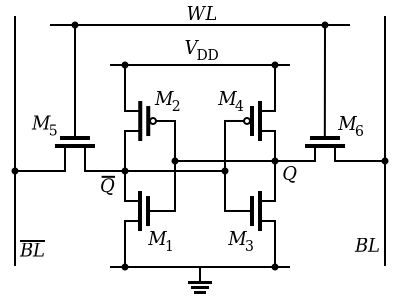
</p>

## Cell Structure

| Transistor | Function |
|------------|----------|
| **M1, M2** | PMOS pull-up transistors forming one inverter pair |
| **M3, M4** | NMOS pull-down transistors forming the complementary inverter pair |
| **M5, M6** | NMOS access transistors connecting the storage nodes to the bitlines |
| **WL** | Enables read and write access to the SRAM cell |
| **BL / BLB** | Differential bitlines used for data transfer |
| **Q / QB** | Complementary storage nodes representing one stored bit |

## Operating Principle

The two cross-coupled CMOS inverters create a bistable latch capable of storing one bit as long as power is supplied.

- During **Hold Mode**, the wordline remains LOW and the stored data is retained.
- During **Read Mode**, the wordline connects the internal storage nodes to the precharged bitlines, allowing the stored value to be sensed.
- During **Write Mode**, the write driver forces complementary values onto the bitlines, updating the stored data.

## Key Design Considerations

- **Cell Ratio (CR)** influences read stability.
- **Write Ratio (WR)** determines write ability.
- Proper transistor sizing is essential for balancing stability, performance, and power consumption.
- Differential bitline operation improves noise immunity and sensing accuracy.

> 📖 Detailed transistor-level analysis and stability discussions are available in the `architecture/` directory.

</details>


<details>
<summary><b>📖 Read & Write Operation Verification</b></summary>

<br>

The primary functions of an SRAM cell are **read** and **write** operations. Both rely on the coordinated timing of the **wordline (WL)**, **bitlines (BL/BLB)**, **precharge circuit**, and **write driver** to ensure reliable data transfer while maintaining cell stability.

## Read Operation

<p align="center">
  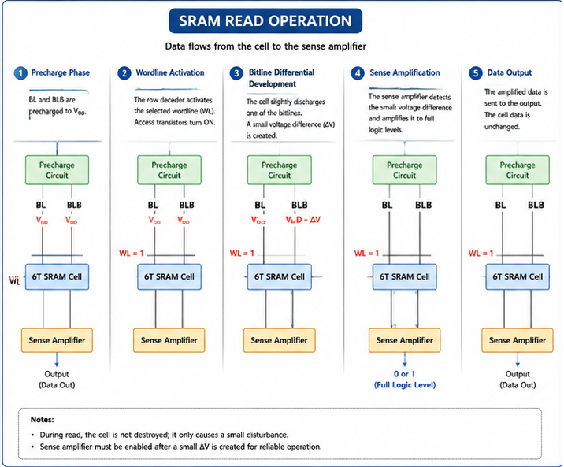
</p>

During a read operation, both bitlines are first precharged to **VDD**. When the **wordline (WL)** is asserted, the access transistors connect the storage nodes to the bitlines. Depending on the stored data, one bitline discharges slightly while the other remains near the precharged voltage. This small differential voltage is then detected and amplified by the sense amplifier.

See the [Integrated 1-Bit SRAM Verification](#integrated-1-bit-sram-verification) section for subsystem-level validation.

### Read Verification

The NGSpice simulation confirms:

- ✅ Successful bitline differential development.
- ✅ Stable data retention during read access.
- ✅ No destructive read behaviour under the selected transistor sizing.
- ✅ Correct interaction between the SRAM cell and precharged bitlines.

---

## Write Operation

<p align="center">
  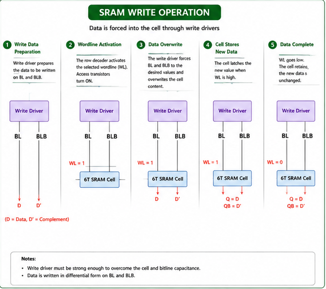
</p>

During a write operation, the write driver forces complementary logic values onto the bitlines (**BL** and **BLB**). When the wordline is enabled, the new data overcomes the previous latch state and updates the stored value inside the SRAM cell.

### Write Verification

The NGSpice simulation verifies:

- ✅ Successful overwrite of the previously stored data.
- ✅ Correct switching of the internal storage nodes (**Q** and **QB**).
- ✅ Reliable operation of the write driver.
- ✅ Stable write behaviour using the SKY130A transistor models.

---

## Verification Summary

The read and write simulations demonstrate the functional correctness of the custom **6T SRAM bitcell** designed in this project. These verified operations establish the basis for higher-level SRAM integration and subsequent OpenRAM-based memory generation.

> 📖 Related SPICE netlists, timing analysis, and waveform results are available in the `verification/` directory.

</details>


<details>
<summary><b>⚙ Peripheral Circuit Design</b></summary>

<br>

In addition to the **6T SRAM bitcell**, several peripheral circuits are required to perform reliable read and write operations. These circuits control memory access, improve signal integrity, and enable efficient communication between the memory array and external logic.

The following peripheral blocks were studied, designed, and verified during this project.

## Precharge Circuit

<p align="center">
  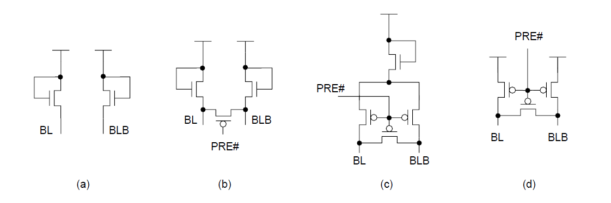
</p>

The precharge circuit initializes both **BL** and **BLB** to **VDD** before every read operation. Equalizing the bitlines minimizes sensing delay and ensures accurate differential voltage development during memory access.

### Verification Summary

- ✅ Bitlines successfully precharged before read operations.
- ✅ Differential sensing enabled through equalized bitlines.
- ✅ Stable operation verified using NGSpice.

## Write Driver

The write driver forces complementary logic values onto the bitlines during write operations. It must be strong enough to overwrite the previous cell state while maintaining reliable switching characteristics.

### Verification Summary

- ✅ Correct complementary bitline generation.
- ✅ Reliable write operation verified.
- ✅ Successful overwrite of stored data.

## Sense Amplifier

<p align="center">
  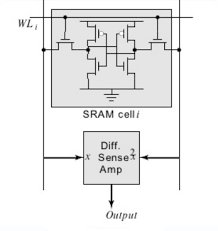
</p>

The sense amplifier detects the small voltage difference that develops between **BL** and **BLB** during a read operation and amplifies it into a full digital logic level.

### Verification Summary

- ✅ Correct differential voltage detection.
- ✅ Reliable logic-level output generation.
- ✅ Integrated successfully with the SRAM read path.

## Row Decoder

The row decoder converts the binary address into a **one-hot wordline selection**, ensuring that only the required memory row is activated during an access operation.

### Key Functions

- ✅ Address decoding
- ✅ Wordline selection
- ✅ Single-row activation

## Column Multiplexer

The column multiplexer selects the required bitline pair from the memory array and routes it to the sense amplifier or output circuitry.

### Key Functions

- ✅ Column selection
- ✅ Bitline routing
- ✅ Output path optimization

## Peripheral Circuit Summary

Together, these peripheral circuits enable reliable SRAM operation by coordinating address decoding, bitline conditioning, write data transfer, read sensing, and output selection. Their successful verification forms the basis of the integrated SRAM design and the subsequent OpenRAM-generated memory macro.

> 📖 Additional circuit schematics and verification reports are available in the `verification/` and `docs/` directories.

</details>

<details>
<summary><b>🏗 Integrated 1-Bit SRAM Verification</b></summary>

<br>

After verifying the individual SRAM building blocks, the complete **1-bit SRAM subsystem** was integrated and simulated to validate the interaction between the memory cell and its supporting peripheral circuits.

The integrated design combines the following functional blocks:

- 6T SRAM Bitcell
- Precharge Circuit
- Write Driver
- Sense Amplifier
- Wordline Control
- Bitline Interface

<p align="center">
  
</p>

## Integrated Verification Objectives

The objective of the integrated simulation was to verify that all SRAM building blocks operate together as a complete memory subsystem.

The verification focused on:

- ✅ Correct write operation
- ✅ Reliable read operation
- ✅ Proper precharge timing
- ✅ Differential bitline behaviour
- ✅ Stable storage node operation
- ✅ Sense amplifier functionality
- ✅ Overall timing coordination

## Simulation Results

The integrated NGSpice simulation confirms:

| Verification Item | Status |
|-------------------|:------:|
| Write Operation | ✅ Verified |
| Read Operation | ✅ Verified |
| Bitline Precharge | ✅ Verified |
| Sense Amplifier Response | ✅ Verified |
| Storage Node Stability | ✅ Verified |
| Integrated Timing | ✅ Verified |

The waveform demonstrates successful coordination between the SRAM bitcell and the peripheral circuitry, confirming that the complete memory subsystem operates correctly under the selected simulation conditions.

> 📖 Complete simulation waveforms, SPICE netlists, and verification reports are available in the `verification/` directory.

---

# OpenRAM Design Flow

After completing the transistor-level design and verification of the SRAM building blocks, the **OpenRAM** compiler was used to generate a complete SRAM macro using the **SKY130A Open-Source PDK**.

OpenRAM automates the generation of memory macros by integrating validated SRAM bitcells with peripheral circuits, control logic, address decoding, and physical layout generation. This enables rapid creation of manufacturable SRAM macros together with the files required for ASIC implementation.

<p align="center">
  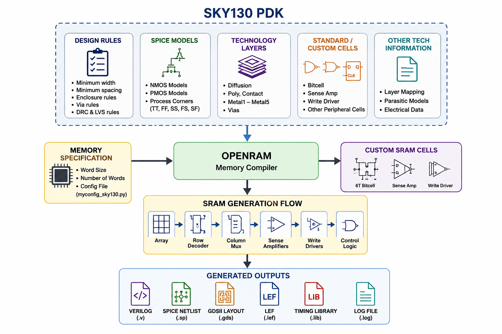
</p>

## OpenRAM Workflow

The overall design flow followed during this project is illustrated below.

```text
SRAM Specification
        │
        ▼
Configuration File
        │
        ▼
OpenRAM Compiler
        │
        ▼
Memory Generation
        │
        ├── Verilog Model
        ├── SPICE Netlist
        ├── Liberty (.lib)
        ├── LEF
        ├── GDSII
        └── HTML Report
```

## Project Workflow

The OpenRAM implementation in this project followed these major steps:

1. Installed and configured **OpenRAM v1.2.49**.
2. Configured the compiler for the **SKY130A** technology.
3. Created the SRAM configuration file.
4. Executed the OpenRAM compiler.
5. Generated the complete SRAM macro and supporting deliverables.
6. Inspected the generated layout using **Magic VLSI**.
7. Documented the generated outputs and verification results.

## Design Objective

The objective of using OpenRAM was to complement the custom circuit-level design with an automated SRAM generation flow. This demonstrates how transistor-level SRAM concepts can be translated into a complete memory macro suitable for digital integration.

> 📖 Generated reports, configuration files, compiler logs, and layout screenshots are available in `reports/week5/` and `docs/openram/`.

</details>

<details>
<summary><b>📈 OpenRAM SRAM Generation</b></summary>

<br>

The final stage of this project involved generating an SRAM macro using **OpenRAM v1.2.49** with the **SKY130A Open-Source PDK**. The compiler automatically integrated the memory array, peripheral circuitry, address decoding, and physical layout to produce a complete SRAM implementation.

<p align="center">
  
</p>

The generated files are summarized in the [Generated Outputs](#generated-outputs) section.

## Task 4 — Validated Intermediate SRAM Configuration

| Parameter | Value |
|-----------|-------|
| Technology | SKY130A Open-Source PDK |
| OpenRAM Version | v1.2.49 |
| Memory Organization | **16 Words × 16 Bits** |
| Total Capacity | 256 Bits |
| Read/Write Ports | 1 RW Port |
| Compiler | OpenRAM |

> **Task 5 Final Result**
>
> The required **1024 × 32 single-port SRAM (32,768 bits / 4 KB)** has been
> generated and signed off. Functional regression, DRC/LVS, extraction,
> characterization, integration, OpenSTA STA, and reproducibility are complete.

## Generation Summary

The OpenRAM compiler successfully generated the complete SRAM macro together with all standard design deliverables required for simulation, physical design, timing analysis, and digital integration. The generated layout was inspected using **Magic VLSI**, and all generated files were documented as part of the internship workflow.

> 📖 **Additional Documentation**
>
> Configuration files, compiler logs, screenshots, and generated reports are available in the **`reports/week5/`** and **`docs/openram/`** directories.

</details>


<details>
<summary><b>📦 Generated Deliverables (GDS, LEF, SPICE, Liberty, Verilog)</b></summary>

<br>

OpenRAM automatically generated the files required for simulation, physical implementation, and ASIC integration.

| File | Description |
|------|-------------|
| **GDSII (.gds)** | Physical layout of the generated SRAM macro |
| **LEF (.lef)** | Abstract physical information for place-and-route |
| **SPICE (.sp)** | Transistor-level netlist |
| **Verilog (.v)** | Functional behavioral model |
| **Liberty (.lib)** | Standard timing library |
| **HTML Report (.html)** | Memory configuration summary |
| **Log File (.log)** | Compiler execution log |

</details>


<details>
<summary><b>📚 Additional Information</b></summary>

<br>

The sections below provide supplementary project information, repository organization, implementation details, and future directions.

## Output Verification

The generated outputs were reviewed to ensure:

- ✅ Successful SRAM macro generation
- ✅ Correct memory organization
- ✅ Availability of physical design files
- ✅ Availability of simulation models
- ✅ Availability of timing libraries
- ✅ Complete compiler documentation

These deliverables represent the standard output package produced by the OpenRAM compiler for downstream ASIC design flows.

</details>


<details>
<summary><b>📁 Repository Structure</b></summary>

<br>

The repository is organized to separate architecture documentation, circuit design, verification results, OpenRAM deliverables, and weekly internship reports.

```text
AI-Assisted-4KB-SRAM-SKY130/
│
├── architecture/          # SRAM architecture and theory
├── assets/                # Images and diagrams
├── docs/                  # OpenRAM documentation
├── Layout/                # Magic layout files
├── openram/               # OpenRAM configuration
├── reports/
│   ├── week1/
│   ├── week2_week3/
│   └── week5/
├── verification/
│   ├── spice/
│   ├── waveforms/
│   └── reports/
├── README.md
└── LICENSE
```

The modular organization enables easy navigation between design documentation, verification results, OpenRAM outputs, and supporting project reports.

</details>


<details>
<summary><b>✅ Final Verification Summary</b></summary>

<br>

The project successfully demonstrates the complete AI-assisted SRAM design workflow using the SKY130A Open-Source PDK, beginning with transistor-level circuit design and progressing through OpenRAM-based SRAM macro generation.

## Verification Checklist

| Verification Stage | Status |
|--------------------|:------:|
| CMOS Inverter Verification | ✅ Passed |
| 6T SRAM Bitcell Design | ✅ Completed |
| SRAM Read Verification | ✅ Passed |
| SRAM Write Verification | ✅ Passed |
| Static Noise Margin (SNM) | ✅ Verified |
| Read Disturb Analysis | ✅ Verified |
| Write Margin Analysis | ✅ Verified |
| Precharge Circuit | ✅ Verified |
| Write Driver | ✅ Verified |
| Sense Amplifier | ✅ Verified |
| Integrated 1-Bit SRAM | ✅ Verified |
| Magic Layout Inspection | ✅ Completed |
| Netgen LVS | ✅ Passed |
| Task 4 OpenRAM Generation | ✅ Completed |
| Task 4 16 × 16 Intermediate Macro | ✅ Generated |
| Task 4 2 × 16 Investigation | ✅ Completed |
| Task 4 Decoder Limitation | ✅ Documented |
| Task 5 Architecture | ✅ Established |
| Task 5 1024 × 32 Generation | ✅ Complete |
| Task 5 Final Validation | ✅ Complete — characterization, integration, OpenSTA STA, reproducibility, and documentation closed |

## Project Outcome

This repository demonstrates the complete engineering workflow for SRAM development using open-source EDA tools.

</details>


<details>
<summary><b>📅 Progress Summary</b></summary>

<br>

The internship project progressed through three major phases.

| Phase | Major Activities | Status |
|--------|------------------|:------:|
| Week 1 | SRAM architecture, CMOS inverter, 6T SRAM fundamentals | ✅ |
| Week 2–3 | Bitcell verification, SNM, read/write, peripheral circuits | ✅ |
| Week 5 | OpenRAM setup, 16 × 16 intermediate macro, 2 × 16 investigation | ✅ |
| Week 6 | 1024 × 32 SRAM implementation and final sign-off | ✅ Complete |

### Overall Progress

- ✅ SRAM architecture study completed
- ✅ Circuit-level verification completed
- ✅ Physical verification completed
- ✅ Task 4 OpenRAM workflow and investigation completed
- ✅ Task 5 1024 × 32 SRAM generation, physical sign-off, characterization, integration, OpenSTA STA, and reproducibility complete
- ✅ Documentation completed

</details>


<details>
<summary><b>🚀 Quick Start</b></summary>

<br>

Clone the repository.

```bash
git clone https://github.com/devduttkadale1/AI-Assisted-4KB-SRAM-SKY130_devdutt_kadale.git
cd AI-Assisted-4KB-SRAM-SKY130_devdutt_kadale
```

### Explore the Repository

1. Review the Project Results.
2. Study the SRAM Architecture.
3. Explore the verification waveforms.
4. Inspect the Magic layouts.
5. Review the OpenRAM flow.
6. Examine the generated outputs.

</details>


<details>
<summary><b>🛠️ Tools & Environment</b></summary>

<br>

| Tool | Purpose |
|------|---------|
| Xschem | Schematic capture |
| NGSpice | Circuit simulation |
| Magic VLSI | Layout inspection |
| Netgen | LVS verification |
| OpenRAM | SRAM generation |
| SKY130A | Open-source PDK |
| Ubuntu (WSL2) | Development platform |
| Git & GitHub | Version control |
| ChatGPT | AI-assisted workflow |

</details>


<details>
<summary><b>🤖 AI-Assisted Workflow</b></summary>

<br>

AI tools assisted with:

- SRAM architecture understanding
- Circuit design guidance
- SPICE simulation planning
- Verification methodology
- OpenRAM setup
- Documentation
- Technical report generation

All AI-generated suggestions were independently verified using Xschem, NGSpice, Magic VLSI, Netgen, and OpenRAM before being incorporated into the final project.

</details>


<details>
<summary><b>🎓 Internship Information</b></summary>

<br>

**Program**

- VSD AI-Assisted Analog, Mixed-Signal & FPGA Internship
- Cohort 1.2

**Project**

- AI-Assisted 4KB SRAM Design using SKY130A and OpenRAM

**Focus Areas**

- SRAM Architecture
- Circuit Design
- SPICE Simulation
- Physical Verification
- OpenRAM Memory Generation
- AI-Assisted Engineering Workflow

</details>


<details>
<summary><b>💡 Technical Skills Demonstrated</b></summary>

<br>

### Analog & Mixed Signal

- CMOS Circuit Design
- SRAM Architecture
- 6T SRAM Bitcell Design
- Peripheral Circuit Design

### Verification

- NGSpice Simulation
- Static Noise Margin Analysis
- Read/Write Verification
- Read Disturb Analysis
- Write Margin Analysis

### Physical Design

- Magic VLSI
- Netgen LVS
- Layout Inspection

### Memory Compiler

- OpenRAM
- SKY130 PDK
- SRAM Macro Generation

### Engineering Workflow

- AI-Assisted Design
- Technical Documentation
- Git & GitHub

</details>

<details>
<summary><b>🚧 Engineering Challenges</b></summary>

<br>

| Challenge | Solution |
|------------|----------|
| OpenRAM configuration issues | Configured SKY130 environment and resolved compiler setup |
| Missing PDK libraries | Corrected technology paths and environment variables |
| Bitcell stability | Verified using SNM butterfly analysis |
| Layout verification | Achieved DRC-clean layout and successful LVS matching |
| OpenRAM macro validation | Generated and inspected final SRAM macro using Magic VLSI |

</details>


<details>
<summary><b>🏷 Key Learning Outcomes</b></summary>

<br> 

Through this project I gained practical experience in:

- SRAM architecture and memory organization
- Transistor-level CMOS circuit design
- SPICE-based circuit simulation
- Physical layout inspection
- Layout versus schematic verification
- OpenRAM memory generation
- AI-assisted engineering workflow
- Technical documentation

</details>


<details>
<summary><b>📈 Future Work</b></summary>

<br>

Possible future extensions beyond the completed Task 5 scope include:

- Full-chip SoC place-and-route integration around the signed-off SRAM hard macro
- Broader voltage/temperature characterization beyond the documented TT/SS/FF scope
- Silicon correlation if fabricated measurements become available
- Advanced AI-assisted memory-design and verification automation

</details>

<details>
<summary><b>📖 References, Resources & Acknowledgements</b></summary>

<br>

The following open-source tools, technologies, documentation, and educational resources were used throughout the design, verification, and documentation of this project.

## Open-Source EDA Tools

| Tool | Purpose |
|------|---------|
| **OpenRAM v1.2.49** | SRAM compiler used for the validated Task 4 16 × 16 intermediate macro and final Task 5 1024 × 32 4 KB SRAM deliverable. |
| **Xschem** | Schematic capture and transistor-level circuit design. |
| **NGSpice** | Circuit simulation, waveform analysis, and functional verification. |
| **Magic VLSI** | Physical layout inspection and DRC verification. |
| **Netgen** | Layout-versus-Schematic (LVS) verification. |

---

## Process Design Kit (PDK)

| Technology | Description |
|------------|-------------|
| **SKY130A Open-Source PDK** | 130 nm CMOS Process Design Kit used for schematic design, layout, simulation, and OpenRAM macro generation. |

---

## Documentation & Technical References

- **OpenRAM** – [GitHub Repository](https://github.com/VLSIDA/OpenRAM)
- **SKY130A PDK** – [Official Documentation](https://skywater-pdk.readthedocs.io/)
- **Magic VLSI** – [Official Website](http://opencircuitdesign.com/magic/)
- **Xschem** – [Official Website](https://xschem.sourceforge.io/)
- **NGSpice** – [Official Website](https://ngspice.sourceforge.io/)
- **Netgen** – [Official Website](http://opencircuitdesign.com/netgen/)

---

## Internship

**VSD AI-Assisted Analog, Mixed-Signal & FPGA Internship**

The internship provided the project objectives, design milestones, validation tasks, and engineering workflow followed throughout this repository.

---

## AI-Assisted Engineering

Artificial Intelligence tools were used as engineering assistants for:

- Understanding SRAM architecture
- Planning circuit implementation
- Debugging OpenRAM setup
- Reviewing verification results
- Improving technical documentation
- Organizing project artifacts

All generated suggestions were independently verified using the corresponding open-source EDA tools before being incorporated into the final project.

---

## Acknowledgements

This project was completed as part of the **VSD AI-Assisted Analog, Mixed-Signal & FPGA Internship**.

The work combines open-source semiconductor design tools, the SKY130A Process Design Kit, OpenRAM, and AI-assisted engineering practices to document a complete SRAM design and verification workflow.

</details>


<details>
<summary><b>📄 License</b></summary>

<br>

This project is released under the MIT License.

See the `LICENSE` file for complete licensing information.

</details>

---

## ❤️ Designed With

- OpenRAM
- SKY130A PDK
- Xschem
- NGSpice
- Magic VLSI
- Netgen
- GitHub
- ChatGPT

---

<p align="center">

⭐ If you found this repository useful, consider giving it a star.

Developed as part of the
VSD AI-Assisted Analog, Mixed-Signal & FPGA Internship

</p>
