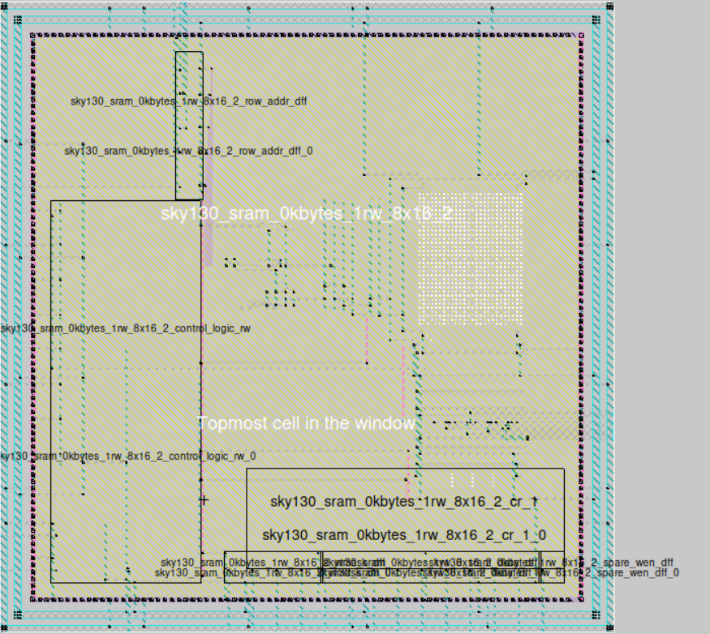

# AI-Assisted 4KB SRAM Design using SKY130 PDK and OpenRAM

> **VSD AI-Assisted Analog, Mixed-Signal & FPGA Internship | Cohort 1.2**  
> **Designer:** Devdutt Bajirao Kadale

---

  

## Overview

This repository documents the complete **AI-assisted design, simulation, verification, and OpenRAM generation workflow** for an SRAM design using the **SKY130A Open-Source PDK**.

The project was completed as part of the **VSD AI-Assisted Analog, Mixed-Signal & FPGA Internship**, covering the complete development flow from transistor-level circuit design through OpenRAM-based SRAM macro generation and physical verification using open-source EDA tools.

The repository combines:

- Transistor-level SRAM circuit design using **Xschem**
- Circuit verification using **NGSpice**
- Layout design and inspection using **Magic VLSI**
- Layout-versus-Schematic verification using **Netgen**
- SRAM macro generation using **OpenRAM v1.2.49**
- AI-assisted engineering workflow with complete documentation and verification

---

## Project Highlights

| Feature | Status |
|---------|:------:|
| CMOS Inverter Verification | ✅ |
| 6T SRAM Bitcell Design | ✅ |
| Read / Write Operation Verification | ✅ |
| Static Noise Margin (SNM) Analysis | ✅ |
| Read Disturb & Write Margin Analysis | ✅ |
| Peripheral Circuit Design | ✅ |
| Integrated 1-Bit SRAM Verification | ✅ |
| OpenRAM SRAM Macro Generation | ✅ |
| Physical Verification Documentation | ✅ |
| Final Generated SRAM Macro | **16 Words × 16 Bits** |

> **Repository Note**
>
> This repository documents the complete AI-assisted workflow for a **4KB SRAM design** using the SKY130A Open-Source PDK. Due to the minimum memory organization supported by the OpenRAM version used during the internship, the final compiler-generated deliverable is a validated **16 × 16 SRAM macro**, while the remaining work demonstrates the complete circuit-level design, verification, physical implementation, and documentation methodology.

---

## Current Project Status

The repository documents the complete development flow of the internship project, from SRAM architecture exploration and transistor-level circuit verification to OpenRAM-based SRAM macro generation and supporting documentation.

| Development Stage | Status |
|-------------------|:------:|
| SRAM Architecture Study | ✅ Complete |
| CMOS Inverter Verification | ✅ Complete |
| 6T SRAM Bitcell Design | ✅ Complete |
| 6T SRAM Bitcell Layout | ✅ Complete |
| 6T Bitcell DRC | ✅ Passed |
| 6T Bitcell LVS | ✅ Passed |
| Read Operation Verification | ✅ Verified |
| Write Operation Verification | ✅ Verified |
| Static Noise Margin (SNM) Analysis | ✅ Verified |
| Read Disturb Analysis | ✅ Verified |
| Write Margin Analysis | ✅ Verified |
| Precharge Circuit Design | ✅ Verified |
| Write Driver Design | ✅ Verified |
| Sense Amplifier Design | ✅ Verified |
| Integrated 1-Bit SRAM Verification | ✅ Complete |
| OpenRAM Environment Setup | ✅ Complete |
| OpenRAM SRAM Generation | ✅ Complete |
| OpenRAM Generated Outputs | ✅ Validated |
| OpenRAM Documentation | ✅ Complete |
| Physical Verification Documentation | ✅ Complete |
| Final Generated SRAM Macro | **16 Words × 16 Bits** |

> **Current Scope**
>
> The circuit-level design, simulation, and verification presented in this repository establish the foundation for a larger SRAM implementation. The OpenRAM deliverables correspond to the validated **16 × 16 SRAM macro**, while the repository documents the complete AI-assisted engineering workflow developed throughout the internship.

---

## Key Achievements

The project successfully integrates circuit-level SRAM design, transistor-level verification, physical implementation, OpenRAM-based SRAM generation, and AI-assisted engineering practices using the SKY130A Open-Source PDK. The key technical achievements are summarized below.

## Circuit Design & Verification

The following SRAM building blocks were designed, simulated, and verified using **Xschem**, **NGSpice**, and the **SKY130A Open-Source PDK**.

- ✅ Designed and simulated a CMOS inverter using the SKY130A PDK.
- ✅ Designed a 6T SRAM bitcell in Xschem.
- ✅ Verified SRAM read and write operations using NGSpice.
- ✅ Performed Static Noise Margin (SNM) analysis using butterfly curves.
- ✅ Verified read disturb and write margin characteristics.
- ✅ Designed and verified the SRAM precharge circuit.
- ✅ Designed and verified the write driver.
- ✅ Designed and verified the sense amplifier.
- ✅ Integrated all major peripheral circuits into a functional 1-bit SRAM testbench.

## Physical Design & Verification

The custom SRAM bitcell layout and the generated OpenRAM SRAM macro were inspected and verified using **Magic VLSI** and **Netgen**, demonstrating both custom-layout verification and compiler-generated macro validation.

- ✅ Created the 6T SRAM bitcell layout in Magic VLSI.
- ✅ Achieved DRC-clean implementation for the custom SRAM bitcell.
- ✅ Successfully completed Netgen LVS verification with matching schematic and layout.
- ✅ Inspected the generated OpenRAM SRAM layout hierarchy using Magic VLSI.
- ✅ Executed and documented the physical verification workflow for the generated SRAM macro.

## OpenRAM SRAM Generation

The OpenRAM compiler was configured with the SKY130A technology to generate the final validated **16 × 16 SRAM macro** together with all standard deliverables required for physical design and digital integration.

- ✅ Installed and configured OpenRAM v1.2.49 with the SKY130A technology.
- ✅ Generated the final **16 × 16 SRAM macro** using the OpenRAM compiler.
- ✅ Validated the generated GDSII, LEF, SPICE, Verilog, Liberty, and HTML deliverables.
- ✅ Documented the complete OpenRAM compilation and verification workflow.

## Documentation & AI-Assisted Workflow

Comprehensive technical documentation was developed throughout the internship to record design decisions, verification methodology, AI-assisted workflows, generated outputs, and project deliverables, ensuring reproducibility and transparency.

- ✅ Maintained complete AI prompt and verification records throughout the project.
- ✅ Produced weekly technical reports documenting project progress.
- ✅ Organized architecture notes, verification reports, and OpenRAM documentation.
- ✅ Preserved reproducible project structure with supporting design files and verification results.

---

# Project Results

The project successfully demonstrates the complete AI-assisted SRAM design workflow using the **SKY130A Open-Source PDK**, beginning with transistor-level circuit development and progressing through OpenRAM-based SRAM macro generation and physical verification.

## Final Project Summary

| Category | Result |
|-----------|--------|
| Technology | SKY130A Open-Source PDK |
| SRAM Bitcell | Custom 6T SRAM Cell |
| Circuit Design | Xschem |
| Circuit Simulation | NGSpice |
| Layout Tool | Magic VLSI |
| LVS Verification | Netgen |
| SRAM Compiler | OpenRAM v1.2.49 |
| Final Generated Macro | **16 × 16 SRAM** |
| Generated Deliverables | GDSII, LEF, SPICE, Verilog, Liberty, HTML |
| AI-Assisted Workflow | Fully Documented |

---

## Representative Results

### 1. SRAM Read Verification

The read simulation demonstrates successful differential bitline development while preserving the stored data inside the SRAM bitcell, confirming correct read functionality.

---

### 2. Static Noise Margin (SNM)

Butterfly curve analysis confirms stable operation of the custom 6T SRAM bitcell under nominal operating conditions using the SKY130A device models.

---

### 3. Integrated 1-Bit SRAM Verification

The integrated verification demonstrates correct interaction between the SRAM bitcell, write driver, precharge circuit, and sense amplifier using a common NGSpice testbench.

---

### 4. Final OpenRAM SRAM Macro

The final validated **16 × 16 SRAM macro** was successfully generated using **OpenRAM v1.2.49**, imported into Magic VLSI, and documented together with the generated deliverables and verification reports.

> **Note**
>
> The repository focuses on documenting the complete engineering workflow. Additional screenshots, verification reports, generated outputs, and OpenRAM documentation are available in the corresponding folders under `verification/`, `docs/openram/`, and `reports/week5/`.

## 📑 Table of Contents

- Project Results
- SRAM Architecture
- 6T SRAM Cell
- Read & Write Operations
- Peripheral Circuits
- Integrated 1-Bit SRAM Verification
- OpenRAM Design Flow
- OpenRAM SRAM Generation
- Repository Structure
- Progress Summary
- Quick Start
- Tools & Environment
- AI Workflow
- Internship Information
- Final Verification Summary
- Future Work