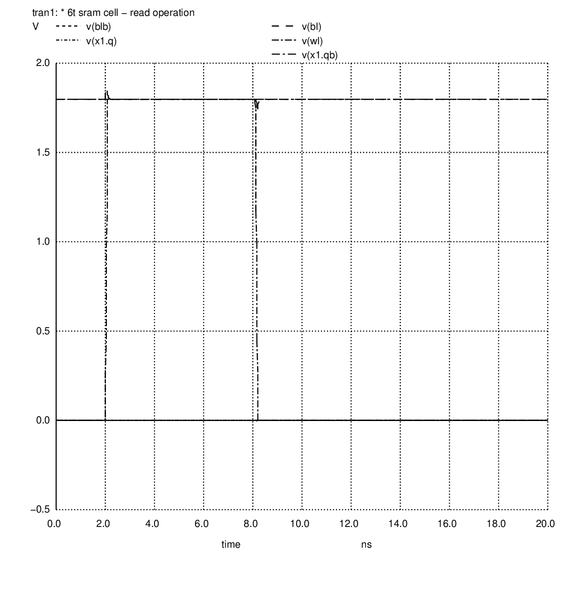
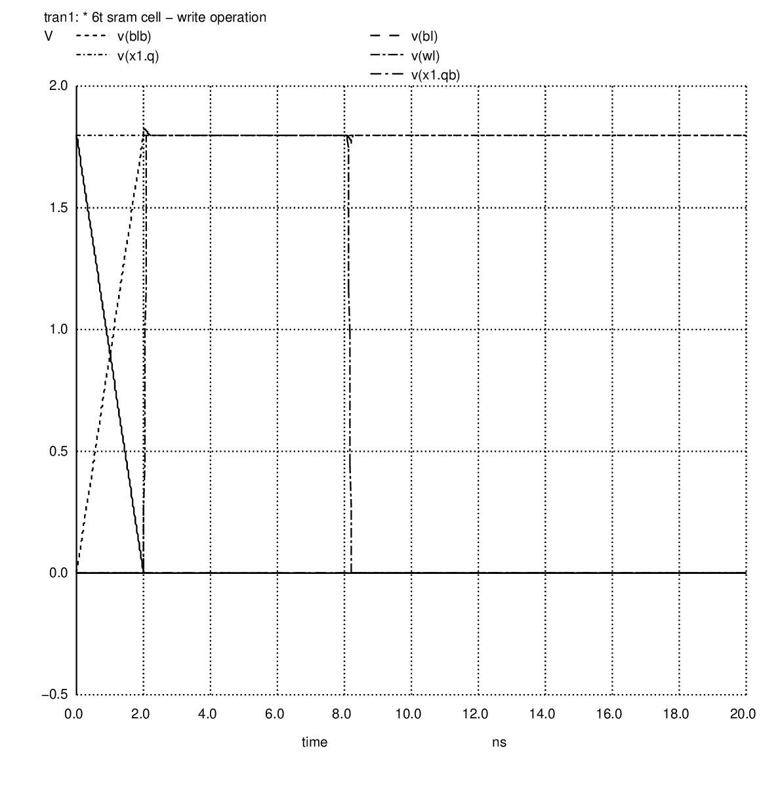
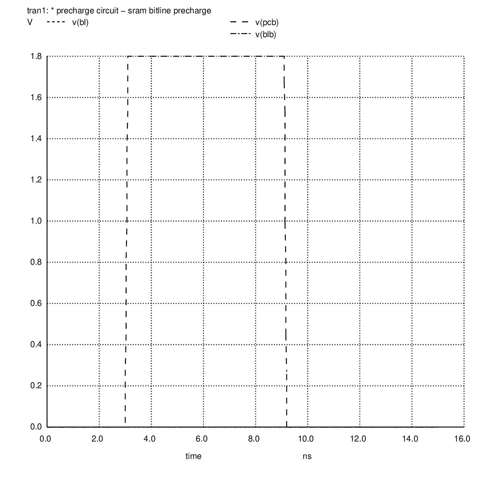
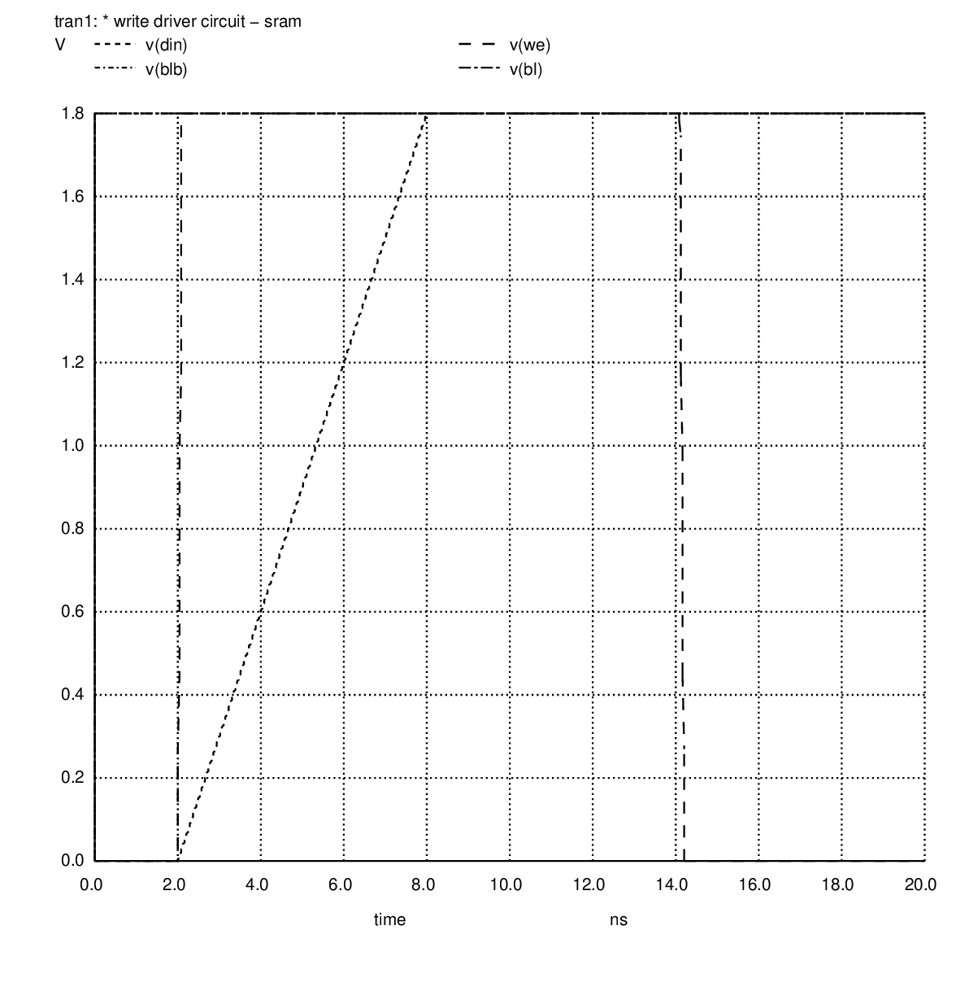
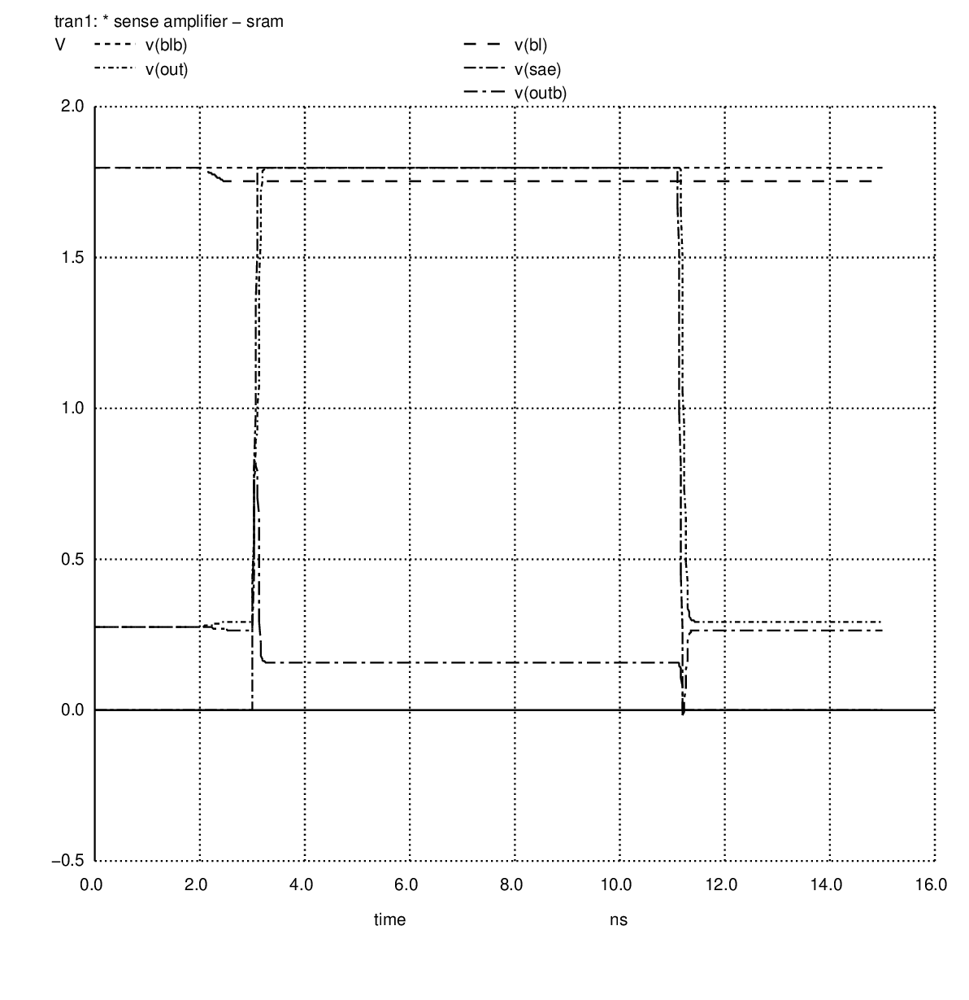
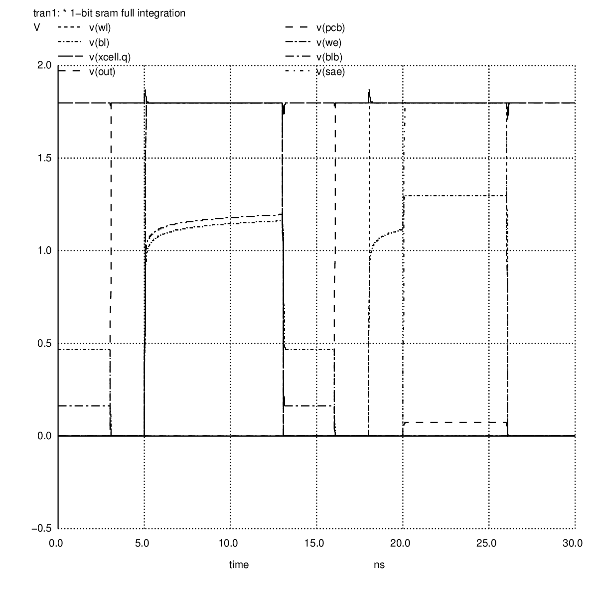

# Week 2 Summary Report

## AI-Assisted 4KB SRAM Design using OpenRAM and SKY130

### Intern

Devdutt Bajirao Kadale

### Internship Program

AI-Assisted Analog, Mixed-Signal and FPGA Internship (Cohort 1.2)

### Tools Used

- ngspice-42
- SKY130 PDK (combined lib, TT corner, 1.8V, 27°C)
- xschem

---

# 1. Week 2 Objective

The objective of Week 2 was to move from theory to simulation — implementing all major SRAM building-block circuits at transistor level using SKY130 PDK models in ngspice, then integrating them into a complete 1-bit SRAM and verifying a full WRITE→READ cycle.

Circuits targeted:

- 6T SRAM cell (READ)
- 6T SRAM cell (WRITE)
- Precharge circuit
- Write driver
- Sense amplifier
- Full 1-bit SRAM integration

---

# 2. Circuit Simulations

## 2.1 6T SRAM Cell — READ Operation


**File:** [`verification/spice/6T_cell_read.spice`](../../verification/spice/6T_cell_read.spice)

**Waveform:**



**Simulation parameters:**
- Transient: 10ps step, 10ns total
- Initial state: Q=1.8V (stored logic 1), QB=0V
- WL pulsed HIGH at 3ns

**Results:**

| Signal | Observation |
|---|---|
| BL | Starts at 1.8V, discharges slightly (~100mV) when WL=HIGH |
| BLB | Remains at 1.8V (cell holds QB=0) |
| Q | Stable at 1.8V throughout — no read disturb |
| Simulation points | 2020 ✅ |

**Key learning:** Cell Ratio (CR) = W_pulldown / W_access = 1µm / 0.5µm = 2 > 1.5 → read disturb prevented.

---

## 2.2 6T SRAM Cell — WRITE Operation

**File:** [`verification/spice/6T_cell_write.spice`](../../verification/spice/6T_cell_write.spice)

**Waveform:**



**Simulation parameters:**
- Transient: 10ps step, 10ns total
- Initial state: Q=1.8V (logic 1)
- Write target: logic 0 (BL=0, BLB=1.8V)
- WL pulsed HIGH at 3ns

**Results:**

| Signal | Observation |
|---|---|
| Q | Flips from 1.8V → 0V within ~1ns after WL assertion |
| QB | Flips from 0V → 1.8V (complementary) |
| Write time | ~1ns |
| Simulation points | 2020 ✅ |

**Key learning:** Write Ratio (WR) = W_access / W_pullup = 0.5µm / 0.5µm = 1 → just sufficient to overwrite the PMOS pull-up.

---

## 2.3 Precharge Circuit


**File:** [`verification/spice/precharge.spice`](../../verification/spice/precharge.spice)

**Waveform:**



**Topology:** 3-PMOS — PC1 (BL pull-up) + PC2 (BLB pull-up) + PC3 (BL-BLB equalizer)

**Results:**

| Signal | Observation |
|---|---|
| BL | Charges from 0 → 1.8V in ~0.5ns when PCB=0 |
| BLB | Charges from 0 → 1.8V in ~0.5ns when PCB=0 |
| BL - BLB | < 10mV after equalization (ready for read) |
| Simulation points | 1520 ✅ |

---

## 2.4 Write Driver

**File:** [`verification/spice/write_driver.spice`](../../verification/spice/write_driver.spice)

**Waveform:**



**Topology:** Inverter + 2 NMOS pull-downs

**Operation:**
- WE=1, DIN=0: BL pulled to GND, BLB held HIGH (via inverter output)
- WE=1, DIN=1: BLB pulled to GND, BL held HIGH

**Results:**

| Signal | Observation |
|---|---|
| BL | Pulled to 0V when WE=1, DIN=0 |
| BLB | Held at 1.8V (complementary drive) |
| Simulation points | 2024 ✅ |

---

## 2.5 Sense Amplifier


**File:** [`verification/spice/sense_amplifier.spice`](../../verification/spice/sense_amplifier.spice)

**Waveform:**



**Topology:** Cross-coupled CMOS latch with 2 input NMOS connected to BL and BLB

**Operation:** SAE (Sense Amp Enable) assertion triggers regenerative latching action

**Results:**

| Signal | Observation |
|---|---|
| Input ΔV (BL−BLB) | ~100mV when SAE fires |
| OUT | Snaps to 0V in < 200ps (reading logic 0) |
| Regeneration time | < 200ps |
| Simulation points | 1526 ✅ |

**Key learning:** SAE must fire only after sufficient ΔV has developed (≥ 50mV). Premature SAE assertion causes wrong output.

---

# 3. Full 1-Bit SRAM Integration

**File:** [`verification/spice/1bit_sram_full.spice`](../../verification/spice/1bit_sram_full.spice)

All four blocks instantiated as subcircuits in a single netlist:

```
Precharge → 6T Cell ← Write Driver
                ↓
          Sense Amplifier
```

**Waveform — full WRITE→READ cycle:**



**Verified timing sequence:**

| Phase | Time | Key Signals | Observation |
|---|---|---|---|
| Precharge | 0–3ns | PCB=0 | BL, BLB → 1.8V ✅ |
| Idle | 3–5ns | PCB=1 | BL, BLB hold at 1.8V ✅ |
| Write 0 | 5–13ns | WE=1, WL=1, DIN=0 | Q: 1.8V → 0V (logic 0 written) ✅ |
| Precharge | 13–16ns | PCB=0 | BL, BLB → 1.8V ✅ |
| Idle | 16–18ns | PCB=1 | BL, BLB hold ✅ |
| Read | 18–26ns | WL=1 | BL discharges ~100mV ✅ |
| Sense | 20–26ns | SAE=1 | OUT → 0V (reads back logic 0 correctly) ✅ |

**Result:** 3050 simulation points. Full WRITE→READ cycle verified. ✅

---

# 4. Key Observations

**Read Disturb:**
Cell Ratio = 2 prevents Q from flipping during read. BL voltage drop is only ~100mV — well within safe margin.

**Write Speed:**
Write completes in ~1ns. Access NFET (W=0.5µm) barely overpowers PMOS pull-up (W=0.5µm). Wider access transistor would improve write margin at cost of read stability.

**Sense Amplifier Timing:**
The most timing-critical block. SAE fired at 20ns (2ns after WL assertion at 18ns) gives ΔV ≈ 100mV — sufficient for reliable sensing. Earlier SAE would risk wrong latch.

**SKY130 TT Corner:**
All simulations at nominal (TT, 27°C, 1.8V). SS corner would show slower write and read; FF corner would show faster switching with possible overshoot.

---

# 5. Problems Encountered and Solutions

| Problem | Root Cause | Solution |
|---|---|---|
| `No such file or directory` | Running ngspice from wrong folder | Always `cd verification/spice` first |
| Heredoc file corruption in WSL | WSL paste corrupts long `cat << EOF` blocks | Used `python3 -c` to write files |
| `.spice` files had wrong PDK path | Wrong path to sky130.lib.spice | Corrected to `/usr/local/share/pdk/sky130A/libs.tech/combined/sky130.lib.spice tt` |
| Sense amp output was wrong | SAE fired too early (< 50mV ΔV) | Delayed SAE by 2ns after WL assertion |

---

# 6. Simulation Files Reference

| File | Location |
|---|---|
| All SPICE netlists | [`verification/spice/`](../../verification/spice/) |
| Raw simulation data (.raw) | [`verification/simulations/`](../../verification/simulations/) |
| Waveform PNGs | [`verification/waveforms/`](../../verification/waveforms/) |
| xschem schematic | [`verification/xschem/`](../../verification/xschem/) |

---

# 7. Week 2 Deliverables

### Simulations Completed

- [x] 6T SRAM READ simulation
- [x] 6T SRAM WRITE simulation
- [x] Precharge circuit simulation
- [x] Write driver simulation
- [x] Sense amplifier simulation
- [x] 1-bit full SRAM integration

### Documentation Completed

- [x] Week 2 summary report (this file)
- [x] [`journal/week2.md`](../../journal/week2.md) — daily learning journal
- [x] AI prompt log updated (Entry 11)

---

# 8. Week 3 Preparation

Week 2 simulation results confirm that all SRAM building blocks work correctly at transistor level with SKY130 PDK models. The design is ready to move to OpenRAM macro generation.

Planned Week 3 activities:

- Install and configure OpenRAM for SKY130
- Generate 4KB SRAM macro (1024 × 32)
- Verify all generated outputs: GDS, LEF, LIB, Verilog, SPICE
- Compare OpenRAM-generated 6T cell vs hand-simulated cell

**Week 2 Status: Completed Successfully ✅**

All 6 circuits simulated. Full WRITE→READ cycle verified. Repository updated.
