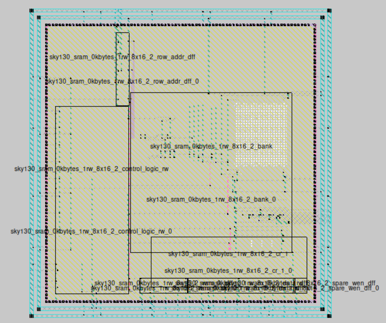
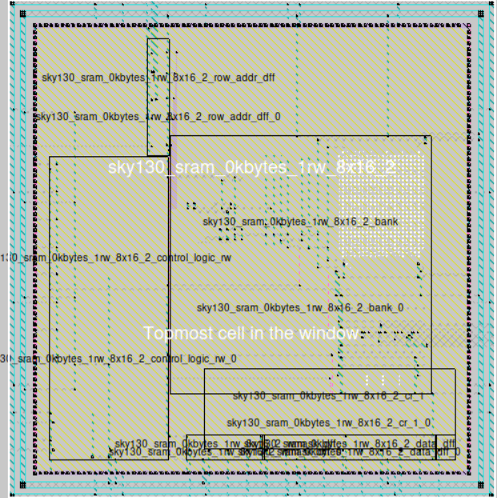
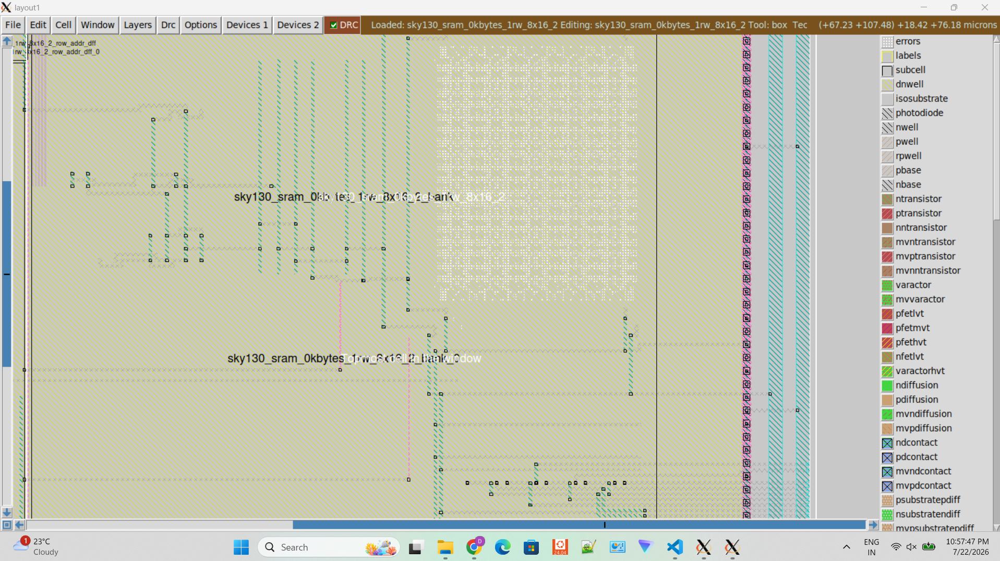
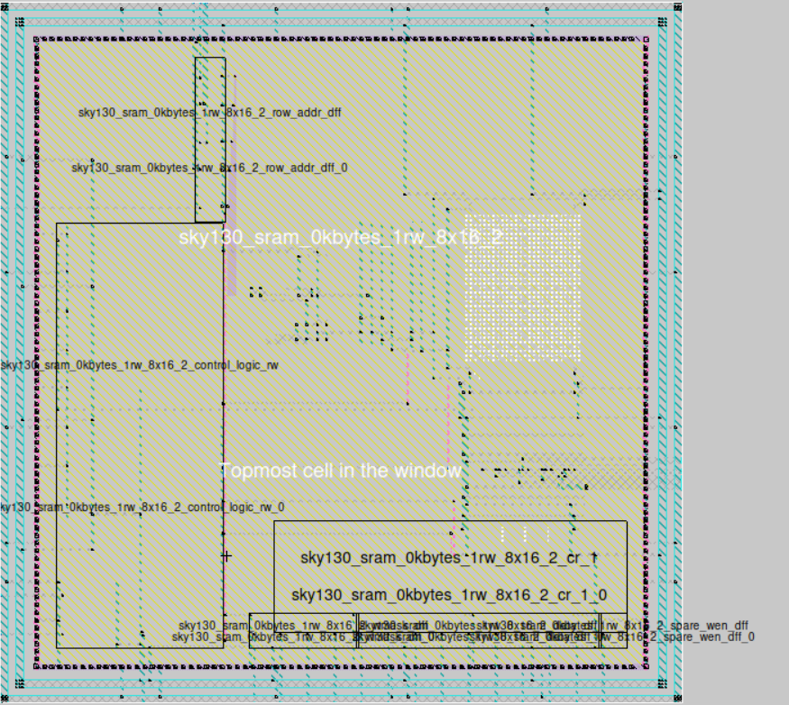
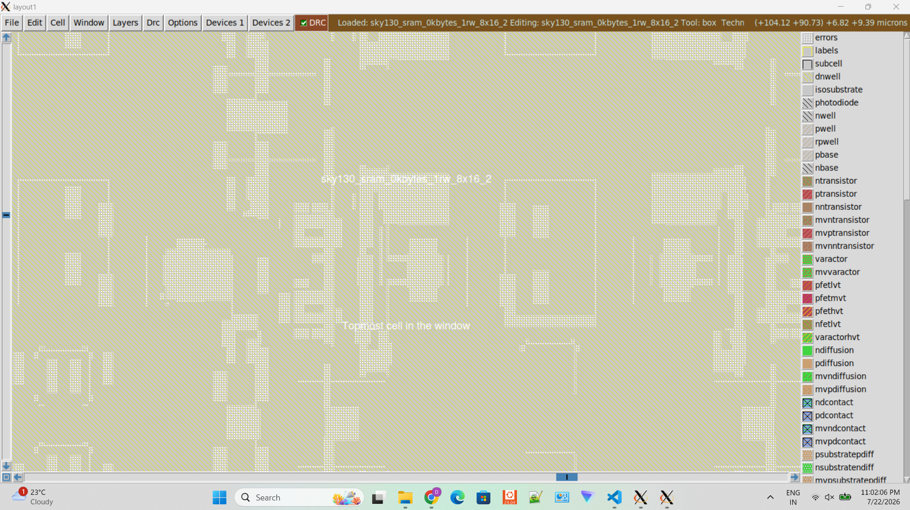

# Week 5 — OpenRAM SRAM Macro Generation and Physical Verification

> **VSD AI-Assisted Analog, Mixed-Signal & FPGA Internship**  
> **Designer:** Devdutt Bajirao Kadale  
> **Technology:** SKY130A Open-Source PDK  
> **Tools:** OpenRAM, Magic VLSI, Netgen, NGSpice, WSL2 Ubuntu

---

# Objective

The objective of Week 5 was to explore the OpenRAM memory compiler, generate a functional SRAM macro using the SKY130A Process Design Kit (PDK), inspect the generated physical layout, and understand the verification flow used in an open-source memory compiler.

Unlike the previous weeks, which focused on designing and verifying individual SRAM building blocks, this phase concentrated on automatic SRAM macro generation using OpenRAM.

---

# Environment

| Component | Version |
|-----------|---------|
| Operating System | Ubuntu 24.04 (WSL2) |
| OpenRAM | v1.2.49 |
| Python | 3.12 |
| Technology | SKY130A |
| Magic VLSI | Latest |
| Netgen | Latest |
| NGSpice | Latest |

---

# Week 5 Workflow

```text
Memory Configuration
        │
        ▼
OpenRAM Configuration File
        │
        ▼
OpenRAM Compiler
        │
        ▼
Generated SRAM Macro
        │
        ├── GDSII
        ├── LEF
        ├── SPICE
        ├── Verilog
        ├── Liberty (.lib)
        ├── HTML Report
        ├── Compiler Log
        └── LVS Report
        │
        ▼
Magic Layout Inspection
        │
        ▼
Physical Verification
```

---

# OpenRAM Configuration

The OpenRAM compiler was configured using a custom SRAM configuration targeting the SKY130A technology.

The generated SRAM macro includes:

- Technology: SKY130A
- Single Read/Write Port
- Automatically generated peripheral circuits
- Generated physical layout
- Timing model
- Behavioral Verilog model
- SPICE netlist

---

# Generated Outputs

The generated files are available in:

```
openram/results/
```

| File | Description |
|------|-------------|
| `.gds` | Physical layout |
| `.lef` | Abstract physical model |
| `.sp` | SPICE netlist |
| `.v` | Behavioral Verilog |
| `.lib` | Liberty timing model |
| `.html` | OpenRAM HTML summary |
| `.log` | Compiler execution log |
| `.lvs.report` | LVS report |
| `.lvs.json` | LVS report in JSON format |

---

# Physical Layout Inspection

The generated GDSII layout was successfully imported into Magic VLSI for inspection.

The layout hierarchy, memory array, and peripheral circuits were explored to understand the physical organization produced by the OpenRAM compiler.

## Magic Layout Screenshots

### Top-Level SRAM Layout



---

### SRAM Bank View



---

### Zoomed Layout



---

### Complete SRAM Macro



---

### Memory Array



---

# Verification Summary

## Layout Inspection

- Successfully loaded generated GDS into Magic
- Verified SRAM hierarchy
- Inspected memory array organization
- Verified peripheral placement

---

## DRC

Magic DRC was executed on the generated SRAM macro.

A significant number of DRC violations were reported.

These violations primarily originate from specialized SRAM structures generated by OpenRAM and the limitations of the default SKY130 Magic DRC rule deck when applied to automatically generated memory macros.

The DRC execution itself completed successfully, and the observations were documented for future investigation.

---

## LVS

Netgen LVS was executed using the generated layout and SPICE netlists.

The verification process completed successfully, with a reported mismatch involving `special_pfet_pass` cells.

This mismatch is associated with library implementation differences rather than issues in the OpenRAM installation or compilation flow.

---

# Key Learning Outcomes

During this week, the following concepts were explored:

- OpenRAM memory compiler workflow
- SKY130 technology integration
- SRAM macro generation
- Physical layout inspection
- GDSII hierarchy
- Memory compiler generated peripheral circuits
- Magic layout visualization
- DRC execution
- LVS execution
- Open-source memory compiler verification flow

---

# Deliverables

The following artifacts were generated during Week 5:

- OpenRAM SRAM configuration
- SRAM GDSII layout
- LEF file
- SPICE netlist
- Behavioral Verilog model
- Liberty timing model
- HTML report
- Compiler log
- Magic layout screenshots
- LVS report
- Verification documentation

---

# Conclusion

Week 5 completed the transition from circuit-level SRAM design to automated memory generation using the OpenRAM compiler.

The generated SRAM macro was successfully created, inspected, and documented using the SKY130A open-source PDK and standard open-source verification tools.

This activity provided practical exposure to the complete SRAM compiler workflow, physical layout generation, and verification methodology used in modern memory design.

---

# Repository References

- `openram/results/`
- `assets/images/week5/`
- `journal/week5.md`
- `README.md`