# Week 5 — OpenRAM SRAM Macro Generation and Physical Verification

> **VSD AI-Assisted Analog, Mixed-Signal & FPGA Internship**  
> **Designer:** Devdutt Bajirao Kadale  
> **Technology:** SKY130A Open-Source PDK  
> **Tools:** OpenRAM, Magic VLSI, Netgen, NGSpice, WSL2 Ubuntu

---

# Objective

The objective of Week 5 was to explore the OpenRAM memory compiler, generate a functional SRAM macro using the SKY130A Process Design Kit (PDK), inspect the generated physical layout, and understand the verification flow used in an open-source memory compiler.

Unlike the previous weeks, which focused on designing and verifying individual SRAM building blocks, this phase concentrated on automatic SRAM macro generation using OpenRAM.

---

# Environment

| Component | Version |
|-----------|---------|
| Operating System | Ubuntu 24.04 (WSL2) |
| OpenRAM | v1.2.49 |
| Python | 3.12 |
| Technology | SKY130A |
| Magic VLSI | Latest |
| Netgen | Latest |
| NGSpice | Latest |

---

# Week 5 Workflow

```text
Memory Configuration
        │
        ▼
OpenRAM Configuration File
        │
        ▼
OpenRAM Compiler
        │
        ▼
Generated SRAM Macro
        │
        ├── GDSII
        ├── LEF
        ├── SPICE
        ├── Verilog
        ├── Liberty (.lib)
        ├── HTML Report
        ├── Compiler Log
        └── LVS Report
        │
        ▼
Magic Layout Inspection
        │
        ▼
Physical Verification
```

---

# OpenRAM Configuration

The OpenRAM compiler was configured using a custom SRAM configuration targeting the SKY130A technology.

The generated SRAM macro includes:

- Technology: SKY130A
- Single Read/Write Port
- Automatically generated peripheral circuits
- Generated physical layout
- Timing model
- Behavioral Verilog model
- SPICE netlist

---

# OpenRAM Compilation Evidence

## Compiler Execution

The OpenRAM compiler was executed using a custom SKY130 SRAM configuration.

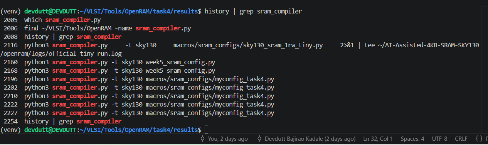

## Generated Files

The successful OpenRAM run produced GDSII, LEF, SPICE, Verilog, Liberty, HTML, and log files.

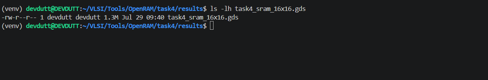

---

# Static Noise Margin (SNM)

The Hold, Read, and Write SNM simulation workflows developed during the previous stages of the project were reviewed and compared as part of Week 5.

The following analyses were considered:

- Hold SNM
- Read SNM
- Write SNM

Butterfly curve analysis confirmed correct operation of the cross-coupled inverter pair. The project documentation reports an SNM of approximately **280–320 mV** at the TT process corner (1.8 V supply). Separate numerical extraction for Hold, Read, and Write SNM was not performed during this phase; instead, the emphasis was on extending the simulation workflow and comparing the operating conditions qualitatively.

---

# Generated Outputs

The generated files are available in:

```
openram/
├── results/
│   ├── task4_sram_16x16.gds
│   ├── task4_sram_16x16.lef
│   ├── task4_sram_16x16.sp
│   ├── task4_sram_16x16.v
│   ├── task4_sram_16x16.html
│   ├── task4_sram_16x16.lvs.sp
│   ├── task4_sram_16x16.log
│   ├── task4_sram_16x16_TT_1p8V_25C.lib
│   ├── task4_sram_16x16_FF_1p8V_25C.lib
│   └── task4_sram_16x16_SS_1p8V_25C.lib
└── archive_2x16/

```

| File | Description |
|------|-------------|
| `.gds` | Physical layout |
| `.lef` | Abstract physical model |
| `.sp` | SPICE netlist |
| `.v` | Behavioral Verilog |
| `.lib` | Liberty timing model |
| `.html` | OpenRAM HTML summary |
| `.log` | Compiler execution log |
| `.lvs.report` | LVS report |
| `.lvs.json` | LVS report in JSON format |

---

# Generated Output Inspection

## HTML Datasheet

OpenRAM automatically generated an HTML summary containing the complete SRAM configuration, operating conditions, timing information, power estimates, characterization corners, and generated deliverables.

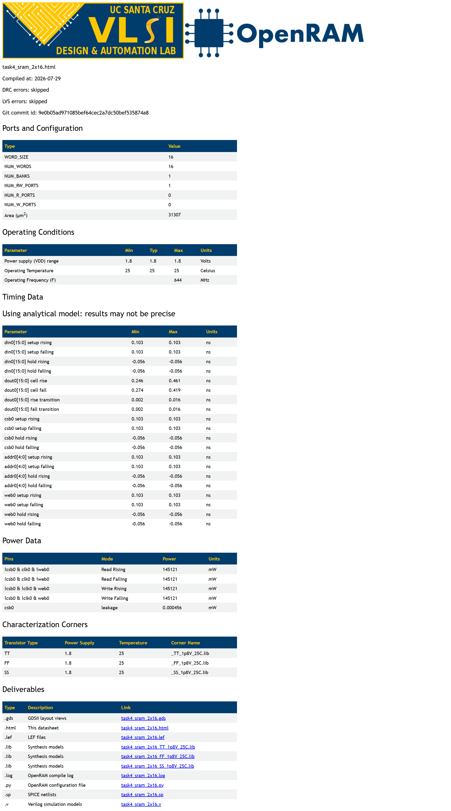

## LEF Physical Abstract

The generated LEF describes the physical abstract of the SRAM macro, including the macro dimensions, symmetry, routing layers, and pin locations required for digital place-and-route integration.

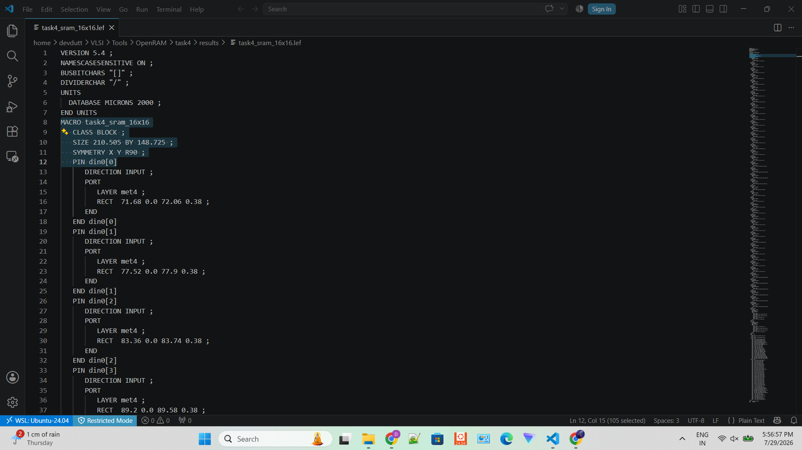

## Liberty Timing Model

OpenRAM generated Liberty timing models for TT, FF, and SS process corners.

The screenshot below illustrates the TT timing model.

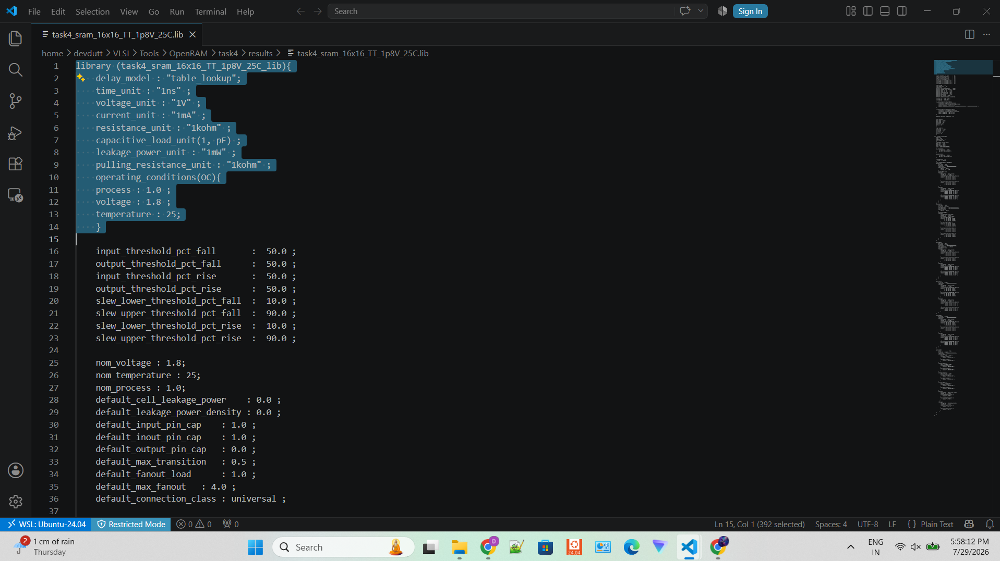

## Behavioral Verilog Model

The automatically generated Verilog model can be used for functional simulation and RTL-level integration.

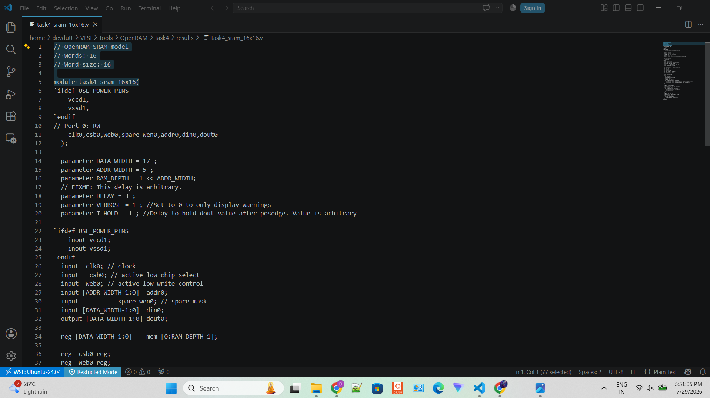

---

# Physical Layout Inspection

The generated GDSII layout was successfully imported into Magic VLSI for inspection.

The layout hierarchy, memory array, and peripheral circuits were explored to understand the physical organization produced by the OpenRAM compiler.

## Magic Layout Screenshots

### Top-Level SRAM Layout

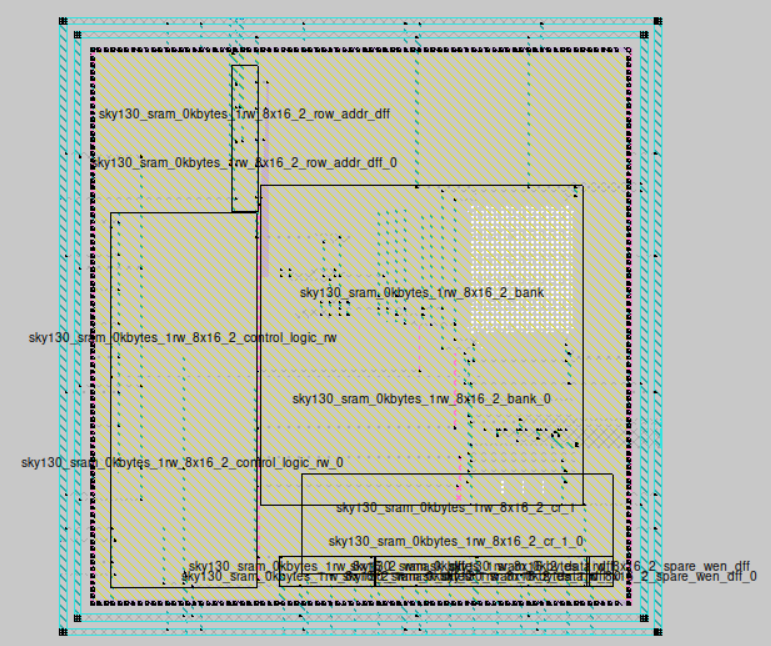

---

### SRAM Bank View

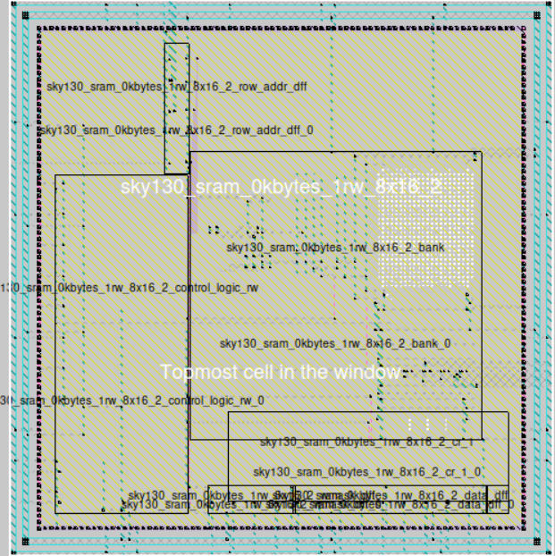

---

### Zoomed Layout

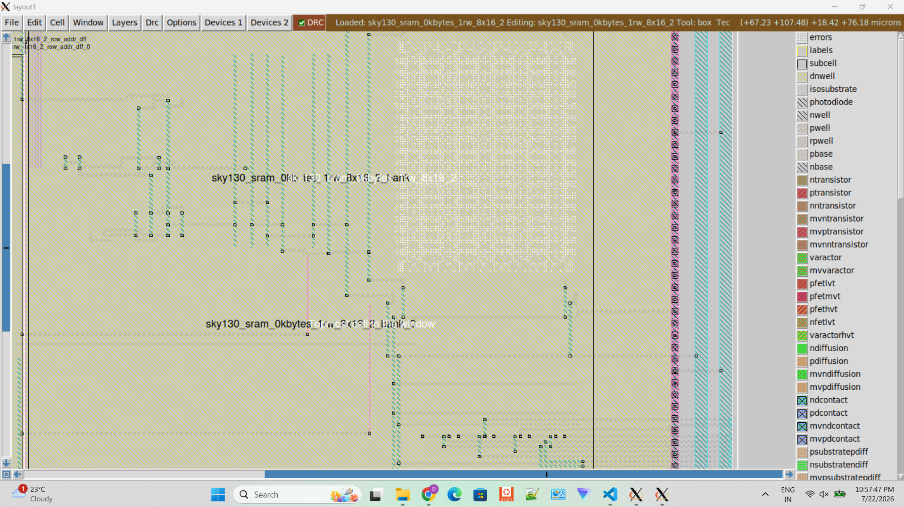

---

### Complete SRAM Macro


---

### Memory Array

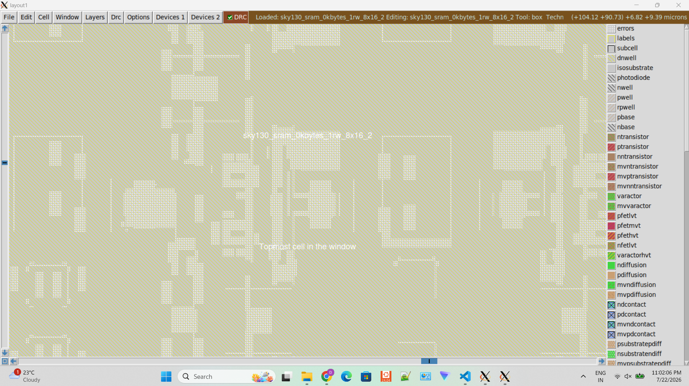

---

# KLayout Verification

## Top-Level Hierarchy

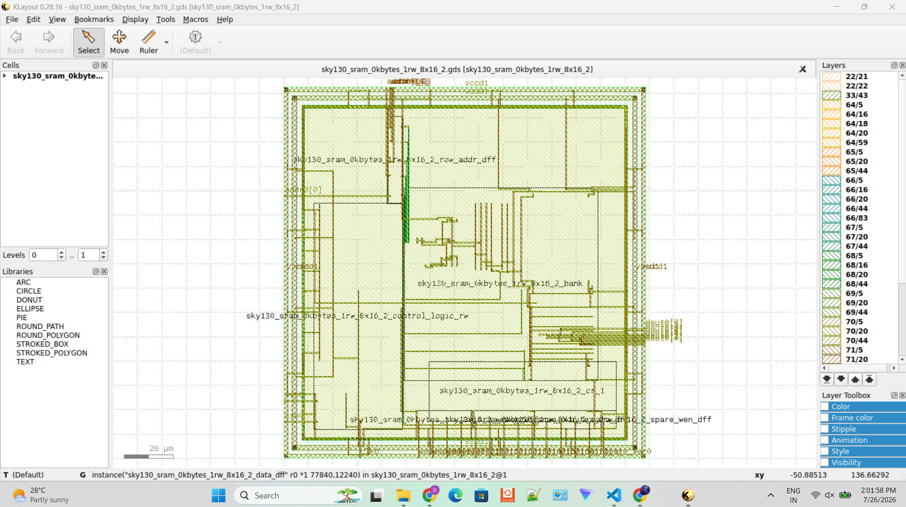

---

## Expanded Hierarchy

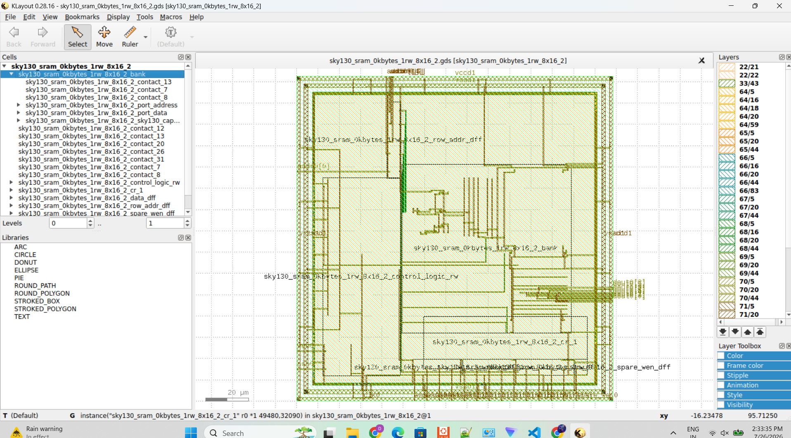

---

## Top-Level Layout

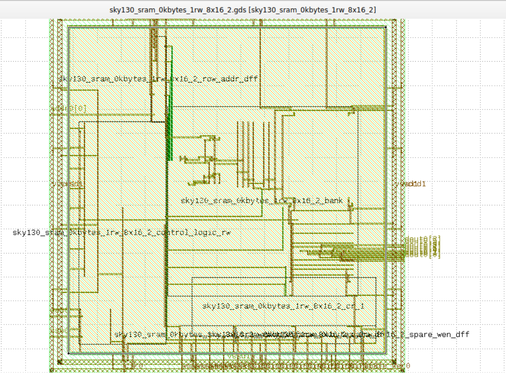

---

# Verification Summary

## Layout Inspection

- Successfully loaded generated GDS into Magic
- Verified SRAM hierarchy
- Inspected memory array organization
- Verified peripheral placement

---

## DRC

Magic DRC was executed on the historical generated SRAM macro. Multiple DRC violations remained, so the layout was **not DRC clean** and must not be treated as physical sign-off. The violations were preserved as Week 5 diagnostic evidence rather than accepted as a successful DRC result.

---

## LVS

Netgen LVS was executed using the historical generated layout and SPICE netlists.

The comparison reported a mismatch involving `special_pfet_pass` cells. Therefore the Week 5 historical macro did **not** achieve clean LVS sign-off. The mismatch remains part of the preserved exploratory verification record and must not be represented as an LVS PASS.

---

# Functional Verification

The generated Verilog model was exercised using self-checking testbenches.

The verification flow included:

- Write operation
- Read operation
- Automatic PASS/FAIL checking
- Regression execution

The testbench correctly detected unknown (`X`) values during simulation, demonstrating that the verification environment can identify functional mismatches.

---

# Key Learning Outcomes

During this week, the following concepts were explored:

- OpenRAM memory compiler workflow
- SKY130 technology integration
- SRAM macro generation
- Physical layout inspection
- GDSII hierarchy
- Memory compiler generated peripheral circuits
- Magic layout visualization
- DRC execution
- LVS execution
- Open-source memory compiler verification flow

---

# Task 4 Goal-B — Exact 2x16 Final Status

The literal Goal-B target was an OpenRAM/SKY130, 1.8 V, single-port SRAM with exactly **2 logical words x 16 data bits** and a one-bit logical address.

Final classification:

**INFEASIBLE_IN_NORMAL_OPENRAM_FLOW**

Pristine OpenRAM 1.2.49 selects `hierarchical_decoder` for the normal row-address path. Exact 2-word organizations require a 0-input or 1-input row decoder, which this normal hierarchical implementation does not support. Adding enough spare rows to make the decoder legal increases the external address width and therefore does not preserve the literal two-word interface.

The historical `task4_sram_2x16` artifact is actually **16 words x 16 bits**. OpenRAM's `sram_2_16_1_sky130` golden artifact is **16 words x 2 bits**. Neither satisfies the literal Goal-B target.

Because Stage B1 proved that no legitimate exact macro can be generated without modifying OpenRAM architecture, stages B2 through B9 were intentionally not executed for the literal target.

Detailed evidence:

- `reports/week5/goal_b/b1_source_evidence.txt`
- `reports/week5/goal_b/b1_feasibility_conclusion.md`

---

# Deliverables

The following artifacts were generated during Week 5:

- OpenRAM SRAM configuration
- SRAM GDSII layout
- LEF file
- SPICE netlist
- Behavioral Verilog model
- Liberty timing model
- HTML report
- Compiler log
- Magic layout screenshots
- LVS report
- Verification documentation

---

# Conclusion

Week 5 established and exercised the OpenRAM/SKY130 SRAM-generation and verification workflow.

A historical **16-word x 16-bit** intermediate macro was generated and inspected, but it did not achieve clean Week 5 DRC/LVS sign-off and it does not satisfy the later literal Goal-B requirement of **2 words x 16 bits**.

A dedicated Goal-B feasibility investigation subsequently proved that an exact 2-word x 16-bit, single-port SKY130 SRAM cannot be generated by the normal unmodified OpenRAM 1.2.49 flow used for this project because the required 0-input or 1-input row-decoder organization is unsupported by the default hierarchical decoder.

Goal B is therefore closed as **INFEASIBLE_IN_NORMAL_OPENRAM_FLOW**, not as a generated-macro PASS.

---

# Repository References

- `results/`
- `assets/images/week5/`
- `journal/week5.md`
- `README.md`