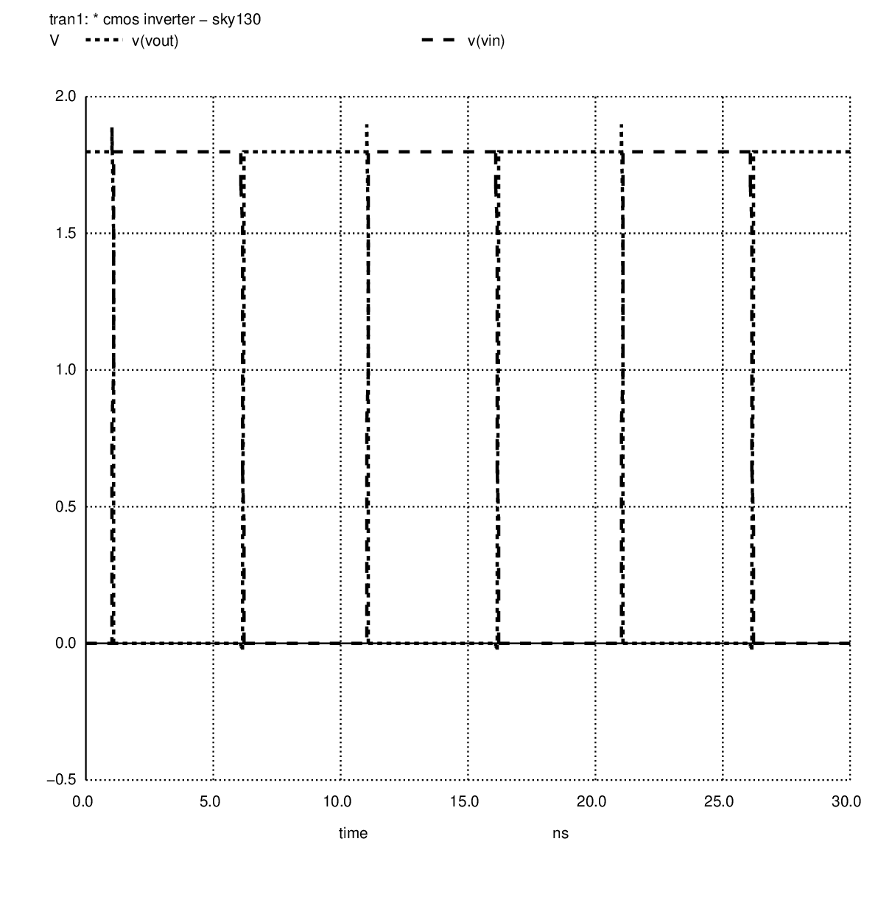
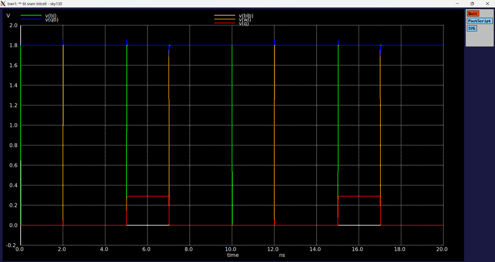

# Verification Waveforms

This directory contains waveform screenshots generated during the AI-assisted verification of SRAM circuit blocks using **Xschem**, **NGSpice**, and the **SKY130A Open-Source PDK**.

Each waveform validates a specific operation or circuit used during the development of the SRAM bitcell and its peripheral blocks.

---

## CMOS Inverter Verification

The CMOS inverter was simulated as the baseline verification before starting SRAM design. The waveform confirms correct switching behaviour and validates the SKY130 simulation environment.

---

## CMOS Inverter Waveform

Transient response of the CMOS inverter showing complementary input and output signals. This simulation verifies the basic CMOS operation used throughout the SRAM design.

---

## 6T SRAM Bitcell

Reference simulation of the complete 6T SRAM bitcell showing the cross-coupled inverter structure and access transistors. This circuit forms the fundamental storage element of the SRAM array.

---

## SRAM Read Operation

Simulation of the SRAM read cycle after wordline activation. The waveform shows bitline differential development while maintaining the stored data without read disturb.

---

## SRAM Write Operation

Simulation of the SRAM write cycle where complementary bitlines successfully overwrite the previous stored value. Demonstrates reliable write functionality.

---

## 6T SRAM Read Verification

Detailed transient verification of the 6T SRAM cell during a read operation. Confirms correct wordline control and stable storage node behaviour.

---

## 6T SRAM Write Verification

Detailed write verification of the 6T SRAM bitcell. Shows successful data transition through the access transistors and storage nodes.

---

## Static Noise Margin (SNM)

Butterfly curve used to evaluate the static noise margin of the SRAM cell. The size of the butterfly lobes indicates the stability of the stored data.

---

## Read Disturb Analysis

Verifies that the stored data remains stable during read access. The simulation confirms that the cell does not unintentionally flip while being read.

---

## Write Margin Analysis

Evaluates the write ability of the SRAM bitcell by measuring the voltage required to overwrite the stored value. Confirms reliable write operation.

---

## Precharge Circuit

Simulation of the SRAM precharge circuit showing both bitlines being charged and equalized before each read operation. Proper precharge improves sensing accuracy.

---

## Sense Amplifier

Transient response of the sense amplifier illustrating the amplification of a small bitline voltage difference into a full digital logic level.

---

## Write Driver

Simulation of the write driver generating complementary bitline voltages required to write new data into the SRAM cell.

---

## 1-Bit SRAM Integrated System (Legacy Overview)

Complete functional verification of the integrated 1-bit SRAM showing the interaction of the bitcell, wordline, bitlines, and peripheral circuitry during read and write operations.

# Integrated 1-Bit SRAM v2 Verification

The integrated SRAM simulation combines the 6T SRAM bitcell with the write driver, precharge circuit, and sense amplifier into a single top-level verification. Separate waveform groups are shown below to illustrate each stage of operation.

---

## Control Signals

The control waveform verifies the correct timing relationship between Precharge Enable (PCB), Write Enable (WE), Wordline (WL), and Sense Amplifier Enable (SAE). Proper sequencing ensures reliable SRAM write and read operations.

---

## Bitline Behaviour

The bitline waveforms show the charging, discharge, equalization, and differential development of BL and BLB throughout the simulation. These transitions demonstrate correct interaction between the precharge circuit, write driver, and SRAM cell.

---

## SRAM Cell Storage Nodes

The internal storage nodes (Q and QB) remain stable during idle periods and correctly preserve the stored data throughout the access cycles. Small transient disturbances recover quickly, indicating stable cell behaviour.

---

## Sense Amplifier Output

The sense amplifier converts the small bitline differential into full CMOS logic levels after the Sense Enable signal is asserted. The outputs OUT and OUTB exhibit complementary switching, confirming correct sensing operation.

---

## Simulation Environment

- **Technology:** SKY130A Open-Source PDK
- **Schematic Capture:** Xschem
- **Circuit Simulator:** NGSpice
- **Supply Voltage:** 1.8 V (Typical TT Corner)
- **Verification Flow:** AI-Assisted Design with Manual Validation

---

## Purpose

These waveform screenshots provide visual verification evidence for the AI-assisted design and validation of the SRAM circuits. Every waveform shown in this folder was generated using open-source EDA tools and used to validate the expected behaviour before layout implementation.

---

## Overall Verification Summary

The AI-assisted verification successfully demonstrates the functional operation of the major SRAM building blocks, including the CMOS inverter, 6T SRAM bitcell, precharge circuit, write driver, sense amplifier, and the integrated 1-bit SRAM system. All simulations were performed using NGSpice with the SKY130A Open-Source PDK and validated through waveform inspection. The integrated simulation confirms correct control sequencing and interaction between the peripheral circuits and the SRAM cell.